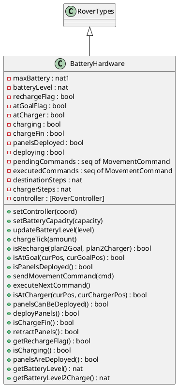
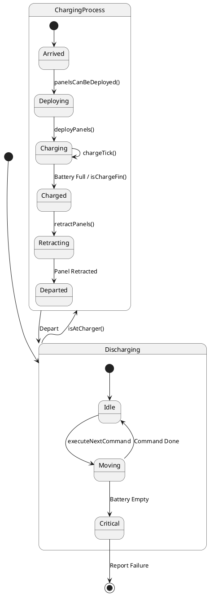
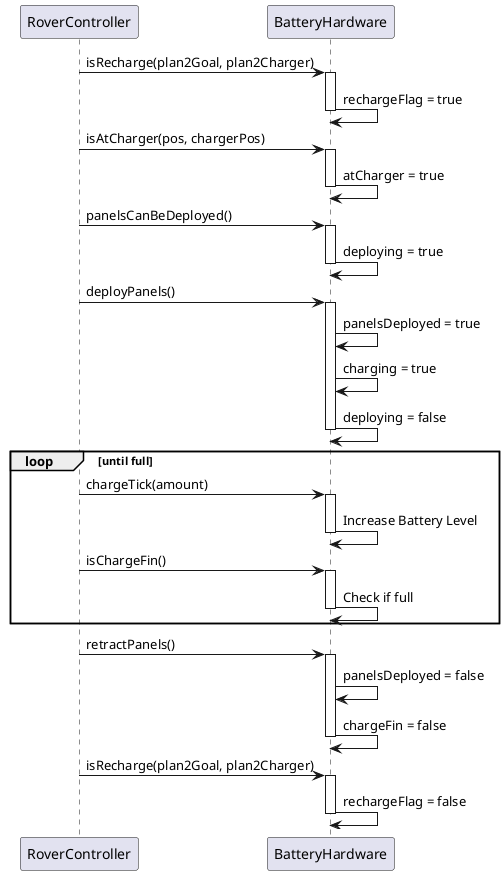
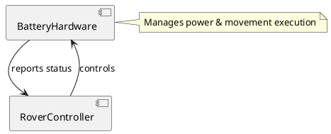

# BatteryHardware コンポーネント仕様

## 概要
バッテリーの状態管理、充電プロセス、および移動によるエネルギー消費をシミュレートするクラス。

## 型定義 (Types)
なし（`RoverTypes` を継承）

## 定数定義 (Values)
なし

## インスタンス変数と不変条件 (State & Invariants)

### 変数一覧
*   `maxBattery`: `nat1` := `defaultMaxBattery`
    *   **説明**: 最大バッテリー容量。
*   `batteryLevel`: `nat` := `maxBattery`
    *   **説明**: 現在のバッテリー残量。
*   `rechargeFlag`: `bool` := `false`
    *   **説明**: 充電要求フラグ（trueなら充電が必要）。
*   `atGoalFlag`: `bool` := `false`
    *   **説明**: ゴール到達フラグ。
*   `atCharger`: `bool` := `false`
    *   **説明**: 充電器上にいるかどうかのフラグ。
*   `charging`: `bool` := `false`
    *   **説明**: 充電中かどうかのフラグ。
*   `panelsDeployed`: `bool` := `false`
    *   **説明**: ソーラーパネル展開状態。
*   `pendingCommands`: `seq of MovementCommand` := `[]`
    *   **説明**: 実行待ちの移動コマンドキュー。
*   `executedCommands`: `seq of MovementCommand` := `[]`
    *   **説明**: 実行済みの移動コマンド履歴。
*   `destinationSteps`: `nat` := `0`
    *   **説明**: 目的地までの推定ステップ数。
*   `chargerSteps`: `nat` := `0`
    *   **説明**: 充電器までの推定ステップ数。
*   `controller`: `[RoverController]` := `nil`
    *   **説明**: コントローラへの参照。

### 不変条件 (Invariant)
*   **式**: `batteryLevel <= maxBattery`
*   **説明**: バッテリー残量は最大容量を超えない。
*   **式**: `(panelsDeployed => atCharger)`
*   **説明**: パネル展開時は充電器上にいる必要がある。
*   **式**: `(charging => atCharger)`
*   **説明**: 充電中は充電器上にいる必要がある。
*   **式**: `(batteryLevel >= destinationSteps + chargerSteps or rechargeFlag)`
*   **説明**: バッテリー残量が移動に必要な量以上か、または充電要求が出ていること。

## オペレーション一覧

### `setController(coord)`
*   **事前条件**: なし
*   **事後条件**: なし
*   **説明**: コントローラを設定します。
*   **関連要件**: コンポーネント間連携。

### `UpdateRechargeFlag()`
*   **事前条件**: なし
*   **事後条件**: なし
*   **説明**: 充電要求フラグを更新する内部操作。
*   **関連要件**: 状態更新。

### `setBatteryCapacity(capacity)`
*   **事前条件**: なし
*   **事後条件**: なし
*   **説明**: バッテリー容量を設定します（初期化用）。
*   **関連要件**: 初期設定。

### `updateBatteryLevel(level)`
*   **事前条件**: `level >= 0`
*   **事後条件**: なし
*   **説明**: バッテリー残量を強制的に更新します（テスト用）。
*   **関連要件**: テスト容易性。

### `chargeTick(amount)`
*   **事前条件**: `charging and amount > 0`
*   **事後条件**: なし
*   **説明**: 充電プロセスを1ステップ進めます（テスト用）。
*   **関連要件**: テスト容易性。

### `isRecharge(plan2Goal, plan2Charger)`
*   **事前条件**: `plan2Goal.steps <> [] and plan2Charger.steps <> []` (両プランは空でないこと)
*   **事後条件**: 
    *   `(rechargeFlag~ and not rechargeFlag => batteryLevel = maxBattery and not chargeFin and not panelsDeployed)`
        *   充電要求フラグがONからOFFに変化するとき、バッテリーが満タンで、充電完了フラグとパネル展開フラグはOFFであること。
    *   `(rechargeFlag => (batteryLevel * 95) div 100 < optionalPlanLength(plan2Goal) + optionalPlanLength(plan2Charger))`
        *   充電要求フラグが立っている場合、バッテリー残量が目的地と充電器までのステップ数の合計より少ないこと。
*   **説明**: 
    *   ComputePlan2ChargingとComputePlan2Destinationから与えられるプラン情報をもとに、充電が必要かどうかを判定し、`rechargeFlag` を更新します。
    *   Roverの各制御を担うRoverControllerから呼び出されます。
    *   `rechargeFlag` が立っている場合、Roverは充電器へ向かう必要があります。
*   **関連要件**: [HI1], [HI2]

### `isAtGoal(curPos, curGoalPos)`
*   **事前条件**: `true`
*   **事後条件**: `atGoalFlag and destinationSteps = 0 or not atGoalFlag`
*   **説明**: 
    *   現在位置がゴール位置と一致するか判定します。一致する場合、`atGoalFlag` をtrueにし、`destinationSteps` を0にします。
*   **関連要件**: [HI3]

### `isPanelsDeployed()`
*   **事前条件**: `true`
*   **事後条件**: `true`
*   **説明**: 
    *   外部からのパネル展開完了通知を受け取るインターフェースです。現在は常に `true` を返します。
*   **関連要件**: [HI6]

### `sendMovementCommand(cmd)`
*   **事前条件**: `not charging` (充電中でないこと)
*   **事後条件**: `true`
*   **説明**: 移動コマンドをキューに追加します。
*   **関連要件**: 移動制御

### `executeNextCommand()`
*   **事前条件**: `pendingCommands <> [] and not charging` (実行待ちコマンドがあり、充電中でないこと)
*   **事後条件**: 
    *   `len pendingCommands = len pendingCommands~ - 1`
    *   `len executedCommands = len executedCommands~ + 1`
    *   `(batteryLevel~ > 0 => batteryLevel = batteryLevel~ - 1)`
*   **説明**: 次の移動コマンドを実行し、バッテリーを消費します。残量が0になると `RoverController.reportBatteryCritical()` を呼び出します。
*   **関連要件**: 移動実行、バッテリー消費

### `isAtCharger(curPos, curChargerPos)`
*   **事前条件**: `rechargeFlag` (充電要求フラグが立っていること)
*   **事後条件**: `atCharger and chargerSteps = 0 or not atCharger`
*   **説明**: 
    *   現在位置が充電器位置と一致するか判定します。一致する場合、`atCharger` フラグを立て、`chargerSteps` を0にします。
*   **関連要件**: [HI2]

### `panelsCanBeDeployed()`
*   **事前条件**: `atCharger and chargerSteps = 0 and batteryLevel < maxBattery and not panelsDeployed`
    *   充電器上にいて、充電器までの残りステップが0で、バッテリー残量が最大容量未満であり、パネルが展開されていないこと。
*   **事後条件**: `atCharger => deploying`
    *   充電器上にいる場合、パネル展開中フラグが立つこと。
*   **説明**: 
    *   太陽電池パネルを展開できるか判定し、展開プロセスを開始（`deploying := true`）します。
*   **関連要件**: [HI6]

### `deployPanels()`
*   **事前条件**: `atCharger and deploying and panelsDeployed = false`
    *   充電器上にいて、パネル展開中フラグが立っており、パネルが展開されていないこと。
*   **事後条件**: `deploying = true or panelsDeployed = true and charging = true and deploying = false`
    *   展開中であるか、または展開完了して充電中状態になること。
*   **説明**: 
    *   太陽電池パネルの展開完了を判定します。`isPanelsDeployed` からの完了通知を受け取ると、パネル展開フラグを立て、充電を開始します。
*   **関連要件**: [HI6]

### `isChargeFin()`
*   **事前条件**: `atCharger and charging and panelsDeployed`
    *   充電器上にいて、充電中であり、パネルが展開されていること。
*   **事後条件**: `batteryLevel = maxBattery and chargeFin and deploying or charging`
    *   バッテリー残量が最大容量に達した場合、充電完了フラグが立ち、充電中状態が解除されること。
*   **説明**: 
    *   充電完了を判定します。満充電になると充電を停止し、パネル収納プロセス（`deploying := true`）へ移行します。
*   **関連要件**: [HI2]

### `retractPanels()`
*   **事前条件**: `atCharger and not charging and chargeFin and panelsDeployed and deploying`
    *   充電器上にいて、充電中でなく、充電完了フラグが立っており、パネルが展開されていること。
*   **事後条件**: `RESULT => not panelsDeployed and not deploying and not chargeFin`
    *   パネルが収納され、パネル展開中フラグが解除されること。
*   **説明**: 
    *   太陽電池パネルを収納します。収納が完了すると、関連するフラグをリセットします。
*   **関連要件**: [HI7]

### `getRechargeFlag()`
*   **事前条件**: なし
*   **事後条件**: なし
*   **説明**: 充電要求フラグの状態を取得します。
*   **関連要件**: 状態確認。

### `isCharging()`
*   **事前条件**: なし
*   **事後条件**: なし
*   **説明**: 充電中かどうかを取得します。
*   **関連要件**: 状態確認。

### `panelsAreDeployed()`
*   **事前条件**: なし
*   **事後条件**: なし
*   **説明**: パネルが展開されているかを取得します。
*   **関連要件**: 状態確認。

### `getBatteryLevel()`
*   **事前条件**: なし
*   **事後条件**: なし
*   **説明**: 
    *   [BM2]判定用バッテリー残量を取得します（制御用）。
    *   BM2要件に準拠して、測定値より5%低く出力します。バッテリ劣化時での信頼性確保が目的です。
*   **関連要件**: 状態確認、[BM2]

### `getBatteryLevel2Charge()`
*   **事前条件**: `charging` (充電中であること)
*   **事後条件**: なし
*   **説明**: 
    *   バッテリー残量を取得します（充電用）。
    *   充電時に充電判断するにはmaxBatteryと比較する必要があるため、生のbatteryLevelを返します。
*   **関連要件**: 充電制御

## UMLモデル (PlantUML)

### 1. クラス図 (Class Diagram)
`BatteryHardware` クラスの構造と、`RoverTypes` の継承関係を示します。

### 2. ステートマシン図 (State Machine Diagram)
バッテリー消費と充電プロセスの状態遷移を示します。TestSuiteの `TestCharging` シナリオに対応しています。

### 3. アクティビティ図 (Activity Diagram)
本コンポーネントの移動消費ロジック (`executeNextCommand`) に関するテストシナリオ (`TestConsumption`) は現在未実装であるため、アクティビティ図は省略します。

### 4. シーケンス図 (Sequence Diagram)
充電プロセスの流れを示します。TestSuiteの `TestCharging` シナリオに対応しています。
なお、`TestInitialization`（初期化）および `TestGoalReach`（ゴール到達判定）については、単純な状態設定・参照操作であるため、図示を省略します。

### 5. コンポーネント図 (Component Diagram)
`BatteryHardware` は `RoverController` によって制御されます。

