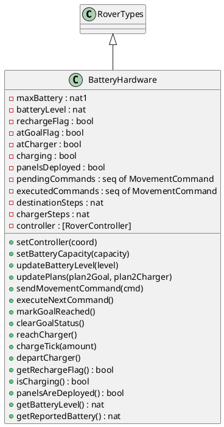
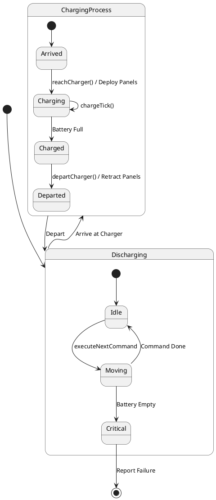
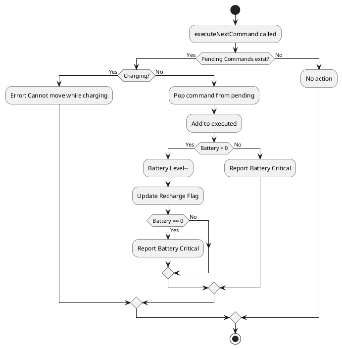
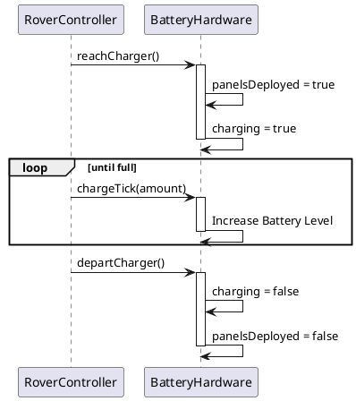
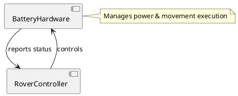

# BatteryHardware コンポーネント仕様

## 概要
バッテリーの状態管理、充電プロセス、および移動によるエネルギー消費をシミュレートするクラス。

## 型定義 (Types)
なし（`RoverTypes` を継承）

## 定数定義 (Values)
なし

## インスタンス変数と不変条件 (State & Invariants)

### 変数一覧
*   `maxBattery`: `nat1` := `defaultMaxBattery`
    *   **説明**: 最大バッテリー容量。
*   `batteryLevel`: `nat` := `maxBattery`
    *   **説明**: 現在のバッテリー残量。
*   `rechargeFlag`: `bool` := `false`
    *   **説明**: 充電要求フラグ（trueなら充電が必要）。
*   `atGoalFlag`: `bool` := `false`
    *   **説明**: ゴール到達フラグ。
*   `atCharger`: `bool` := `false`
    *   **説明**: 充電器上にいるかどうかのフラグ。
*   `charging`: `bool` := `false`
    *   **説明**: 充電中かどうかのフラグ。
*   `panelsDeployed`: `bool` := `false`
    *   **説明**: ソーラーパネル展開状態。
*   `pendingCommands`: `seq of MovementCommand` := `[]`
    *   **説明**: 実行待ちの移動コマンドキュー。
*   `executedCommands`: `seq of MovementCommand` := `[]`
    *   **説明**: 実行済みの移動コマンド履歴。
*   `destinationSteps`: `nat` := `0`
    *   **説明**: 目的地までの推定ステップ数。
*   `chargerSteps`: `nat` := `0`
    *   **説明**: 充電器までの推定ステップ数。
*   `controller`: `[RoverController]` := `nil`
    *   **説明**: コントローラへの参照。

### 不変条件 (Invariant)
*   **式**: `batteryLevel <= maxBattery`
*   **説明**: バッテリー残量は最大容量を超えない。
*   **式**: `(panelsDeployed => atCharger)`
*   **説明**: パネル展開時は充電器上にいる必要がある。
*   **式**: `(charging => atCharger)`
*   **説明**: 充電中は充電器上にいる必要がある。
*   **式**: `(batteryLevel >= destinationSteps + chargerSteps or rechargeFlag)`
*   **説明**: バッテリー残量が移動に必要な量以上か、または充電要求が出ていること。

## オペレーション一覧

### `setController(coord)`
*   **事前条件**: なし
*   **事後条件**: なし
*   **説明**: コントローラを設定します。
*   **関連要件**: コンポーネント間連携。

### `UpdateRechargeFlag()`
*   **事前条件**: なし
*   **事後条件**: なし
*   **説明**: 充電要求フラグを更新する内部操作。
*   **関連要件**: 状態更新。

### `setBatteryCapacity(capacity)`
*   **事前条件**: なし
*   **事後条件**: なし
*   **説明**: バッテリー容量を設定します（初期化用）。
*   **関連要件**: 初期設定。

### `updateBatteryLevel(level)`
*   **事前条件**: `level >= 0`
*   **事後条件**: なし
*   **説明**: バッテリー残量を強制的に更新します（テスト用）。
*   **関連要件**: テスト容易性。

### `updatePlans(plan2Goal, plan2Charger)`
*   **事前条件**: なし
*   **事後条件**: なし
*   **説明**: 現在のプランに基づいて、ゴールおよび充電器までの必要ステップ数を更新し、充電が必要か再評価します。
*   **関連要件**: エネルギー管理。

### `sendMovementCommand(cmd)`
*   **事前条件**: `not charging` (充電中でないこと)
*   **事後条件**: なし
*   **説明**: 移動コマンドをキューに追加します。
*   **関連要件**: 移動制御。

### `executeNextCommand()`
*   **事前条件**: `pendingCommands <> [] and not charging` (実行待ちコマンドがあり、充電中でないこと)
*   **事後条件**: 
    *   `len pendingCommands = len pendingCommands~ - 1`
    *   `len executedCommands = len executedCommands~ + 1`
    *   `(batteryLevel~ > 0 => batteryLevel = batteryLevel~ - 1)`
*   **説明**: 次の移動コマンドを実行し、バッテリーを消費します。残量が0になると `RoverController.reportBatteryCritical()` を呼び出します。
*   **関連要件**: 移動実行、バッテリー消費、枯渇警告。

### `markGoalReached()`
*   **事前条件**: なし
*   **事後条件**: なし
*   **説明**: ゴール到達をマークします。
*   **関連要件**: 状態更新。

### `clearGoalStatus()`
*   **事前条件**: なし
*   **事後条件**: なし
*   **説明**: ゴール到達状態をクリアします。
*   **関連要件**: 状態リセット。

### `reachCharger()`
*   **事前条件**: なし
*   **事後条件**: なし
*   **説明**: 充電器に到達したことを通知し、パネルを展開して充電モードへ移行します。
*   **関連要件**: 充電プロセス開始。

### `chargeTick(amount)`
*   **事前条件**: `charging and amount > 0`
*   **事後条件**: なし
*   **説明**: 充電プロセスを1ステップ進めます。バッテリーを回復し、満タンになると充電を終了します。
*   **関連要件**: 充電実行。

### `departCharger()`
*   **事前条件**: `atCharger`
*   **事後条件**: なし
*   **説明**: 充電器から離脱し、パネルを収納します。
*   **関連要件**: 充電プロセス終了。

### `getRechargeFlag()`
*   **事前条件**: なし
*   **事後条件**: なし
*   **説明**: 充電要求フラグの状態を取得します。
*   **関連要件**: 状態確認。

### `isCharging()`
*   **事前条件**: なし
*   **事後条件**: なし
*   **説明**: 充電中かどうかを取得します。
*   **関連要件**: 状態確認。

### `panelsAreDeployed()`
*   **事前条件**: なし
*   **事後条件**: なし
*   **説明**: パネルが展開されているかを取得します。
*   **関連要件**: 状態確認。

### `getBatteryLevel()`
*   **事前条件**: なし
*   **事後条件**: なし
*   **説明**: バッテリー残量を取得します。
*   **関連要件**: 状態確認。

### `getReportedBattery()`
*   **事前条件**: なし
*   **事後条件**: なし
*   **説明**: 報告用のバッテリー残量を取得します（誤差を含む）。
*   **関連要件**: テレメトリ。

### `getPendingCommands()`
*   **事前条件**: なし
*   **事後条件**: なし
*   **説明**: 実行待ちコマンドを取得します。
*   **関連要件**: デバッグ、状態確認。

### `getExecutedCommands()`
*   **事前条件**: なし
*   **事後条件**: なし
*   **説明**: 実行済みコマンドを取得します。
*   **関連要件**: デバッグ、履歴確認。

## UMLモデル (PlantUML)

### 1. クラス図 (Class Diagram)
`BatteryHardware` クラスの構造と、`RoverTypes` の継承関係を示します。

### 2. ステートマシン図 (State Machine Diagram)
バッテリー消費と充電プロセスの状態遷移を示します。

### 3. アクティビティ図 (Activity Diagram)
`executeNextCommand` におけるコマンド実行とバッテリー消費のロジックを示します。

### 4. シーケンス図 (Sequence Diagram)
充電プロセスの流れを示します。

### 5. コンポーネント図 (Component Diagram)
`BatteryHardware` は `RoverController` によって制御されます。

