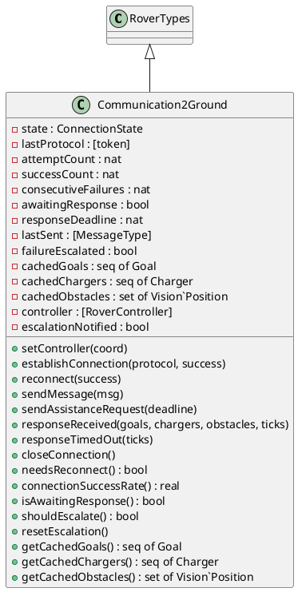
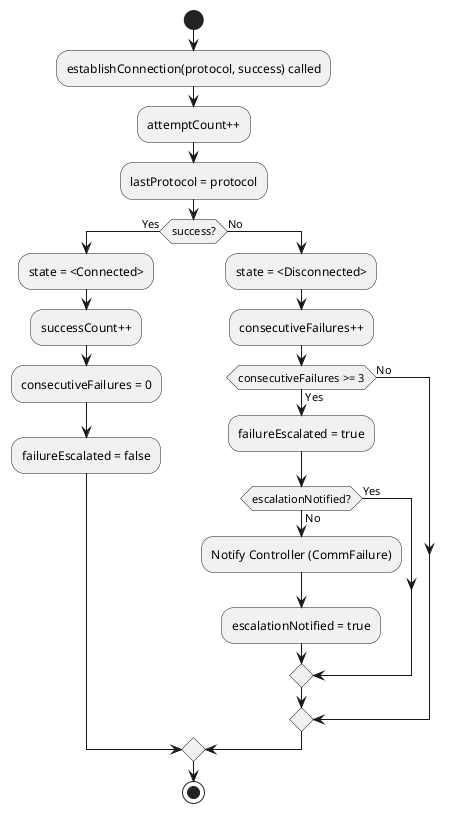
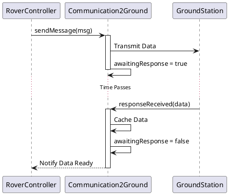
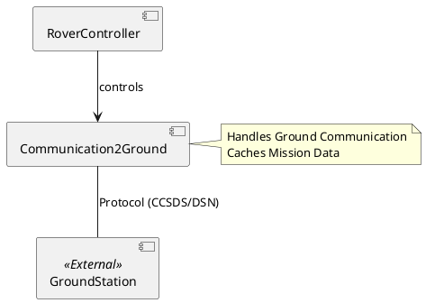

# Communication2Ground コンポーネント仕様

## 概要
地上局との通信を管理するクラス。接続の確立、メッセージの送受信、タイムアウト管理、障害エスカレーションを行います。

## 型定義 (Types)

### `GroundMessage`
*   **定義**: `record mtype: MessageType, payload: seq of char, ticks: nat end`
*   **説明**: 地上局へのメッセージ構造体。

## 定数定義 (Values)

### `supportedProtocols`
*   **値**: `{ mk_token("CCSDS"), mk_token("DSN") }`
*   **説明**: サポートされている通信プロトコル。

## インスタンス変数と不変条件 (State & Invariants)

### 変数一覧
*   `state`: `ConnectionState` := `<Disconnected>`
    *   **説明**: 通信状態（Connected/Disconnected）。
*   `lastProtocol`: `[token]` := `nil`
    *   **説明**: 最後に使用したプロトコル。
*   `attemptCount`: `nat` := `0`
    *   **説明**: 接続試行回数。
*   `successCount`: `nat` := `0`
    *   **説明**: 接続成功回数。
*   `consecutiveFailures`: `nat` := `0`
    *   **説明**: 連続失敗回数。
*   `awaitingResponse`: `bool` := `false`
    *   **説明**: 応答待ちフラグ。
*   `responseDeadline`: `nat` := `0`
    *   **説明**: 応答期限（ティック数）。
*   `lastSent`: `[MessageType]` := `nil`
    *   **説明**: 最後に送信したメッセージタイプ。
*   `failureEscalated`: `bool` := `false`
    *   **説明**: 障害エスカレーションフラグ。
*   `cachedGoals`: `seq of Goal` := `[]`
    *   **説明**: キャッシュされたゴール情報。
*   `cachedChargers`: `seq of Charger` := `[]`
    *   **説明**: キャッシュされた充電器情報。
*   `cachedObstacles`: `set of Vision`Position` := `{}`
    *   **説明**: キャッシュされた障害物情報。
*   `controller`: `[RoverController]` := `nil`
    *   **説明**: コントローラへの参照。
*   `escalationNotified`: `bool` := `false`
    *   **説明**: エスカレーション通知済みフラグ。

### 不変条件 (Invariant)
*   **式**: `successCount <= attemptCount`
*   **説明**: 成功回数は試行回数以下であること。
*   **式**: `(state = <Connected> => attemptCount > 0)`
*   **説明**: 接続状態ならば試行回数は1以上であること。
*   **式**: `(failureEscalated => consecutiveFailures >= 3)`
*   **説明**: エスカレーション時は連続失敗回数が3以上であること。

## オペレーション一覧

### `isSupportedProtocol(protocol)`
*   **事前条件**: なし
*   **事後条件**: なし
*   **説明**: プロトコルがサポートされているか確認する内部関数。
*   **関連要件**: プロトコル検証。

### `validateMessageType(mtype)`
*   **事前条件**: なし
*   **事後条件**: なし
*   **説明**: メッセージタイプが有効か検証します。
*   **関連要件**: データ検証。

### `setController(coord)`
*   **事前条件**: なし
*   **事後条件**: なし
*   **説明**: コントローラを設定します。
*   **関連要件**: コンポーネント間連携。

### `establishConnection(protocol, success)`
*   **事前条件**: `isSupportedProtocol(protocol)` (プロトコルがサポートされていること)
*   **事後条件**: 
    *   `attemptCount = attemptCount~ + 1`
    *   `(success => state = <Connected> and successCount = successCount~ + 1)`
    *   `(not success => state = <Disconnected> and consecutiveFailures = consecutiveFailures~ + 1)`
*   **説明**: 指定されたプロトコルで接続を試行します。連続失敗回数が閾値（3回）を超えると障害を報告します。
*   **関連要件**: 接続管理、障害検知。

### `reconnect(success)`
*   **事前条件**: なし
*   **事後条件**: なし
*   **説明**: 最後に使用したプロトコル（またはデフォルト）で再接続を試みます。
*   **関連要件**: 接続回復。

### `sendMessage(msg)`
*   **事前条件**: `state = <Connected> and validateMessageType(msg.mtype) and msg.ticks <= 10`
*   **事後条件**: `lastSent = msg.mtype and awaitingResponse and responseDeadline = msg.ticks`
*   **説明**: メッセージを送信し、応答待ち状態 (`awaitingResponse`) に移行します。応答期限を設定します。
*   **関連要件**: データ送信、タイムアウト管理。

### `sendAssistanceRequest(deadline)`
*   **事前条件**: `state = <Connected> and deadline <= 10`
*   **事後条件**: なし
*   **説明**: 故障時の支援要請メッセージを送信します。
*   **関連要件**: 故障回復支援。

### `responseReceived(goals, chargers, obstacles, ticks)`
*   **事前条件**: `state = <Connected> and awaitingResponse and ticks <= responseDeadline`
*   **事後条件**: なし
*   **説明**: 地上局からの応答を処理します。受信したデータをキャッシュし、応答待ち状態を解除します。
*   **関連要件**: データ受信、同期。

### `responseTimedOut(ticks)`
*   **事前条件**: なし
*   **事後条件**: なし
*   **説明**: 応答がタイムアウトしたか確認します。
*   **関連要件**: タイムアウト判定。

### `closeConnection()`
*   **事前条件**: なし
*   **事後条件**: なし
*   **説明**: 接続を切断します。
*   **関連要件**: 接続終了。

### `needsReconnect()`
*   **事前条件**: なし
*   **事後条件**: なし
*   **説明**: 再接続が必要か（切断状態か）確認します。
*   **関連要件**: 接続状態確認。

### `connectionSuccessRate()`
*   **事前条件**: なし
*   **事後条件**: なし
*   **説明**: 接続成功率を計算します。
*   **関連要件**: 通信品質モニタリング。

### `isAwaitingResponse()`
*   **事前条件**: なし
*   **事後条件**: なし
*   **説明**: 応答待ちかどうかを確認します。
*   **関連要件**: 状態確認。

### `shouldEscalate()`
*   **事前条件**: なし
*   **事後条件**: なし
*   **説明**: エスカレーションすべきか（障害状態か）確認します。
*   **関連要件**: 障害管理。

### `resetEscalation()`
*   **事前条件**: なし
*   **事後条件**: なし
*   **説明**: エスカレーション状態をリセットします。
*   **関連要件**: 障害回復。

### `getCachedGoals()`
*   **事前条件**: なし
*   **事後条件**: なし
*   **説明**: キャッシュされたゴール情報を取得します。
*   **関連要件**: データ提供。

### `getCachedChargers()`
*   **事前条件**: なし
*   **事後条件**: なし
*   **説明**: キャッシュされた充電器情報を取得します。
*   **関連要件**: データ提供。

### `getCachedObstacles()`
*   **事前条件**: なし
*   **事後条件**: なし
*   **説明**: キャッシュされた障害物情報を取得します。
*   **関連要件**: データ提供。

## UMLモデル (PlantUML)

### 1. クラス図 (Class Diagram)
`Communication2Ground` クラスの構造と、`RoverTypes` の継承関係を示します。



### 2. ステートマシン図 (State Machine Diagram)
地上局との接続状態およびメッセージ送受信の遷移を示します。

```plantuml
@startuml
[*] --> Disconnected

state Disconnected {
  entry / consecutiveFailures++
}

state Connected {
  [*] --> Idle
  Idle --> AwaitingResponse : sendMessage
  AwaitingResponse --> Idle : responseReceived
  AwaitingResponse --> Disconnected : Timeout / Connection Lost
}

Disconnected --> Connected : establishConnection(success=true)
Connected --> Disconnected : establishConnection(success=false)

Disconnected --> FailureReported : consecutiveFailures >= 3
FailureReported --> Disconnected : resetEscalation
@enduml
```

### 3. アクティビティ図 (Activity Diagram)
`establishConnection` における接続試行と障害エスカレーションのロジックを示します。



### 4. シーケンス図 (Sequence Diagram)
メッセージ送信と応答受信の流れを示します。



### 5. コンポーネント図 (Component Diagram)
`Communication2Ground` は `RoverController` によって制御され、外部システム（地上局）と通信します。



