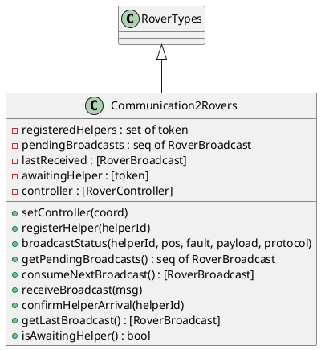
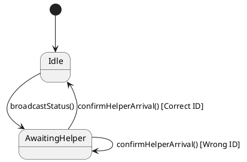
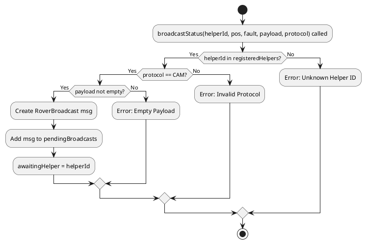
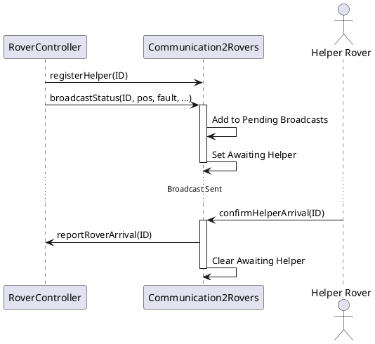
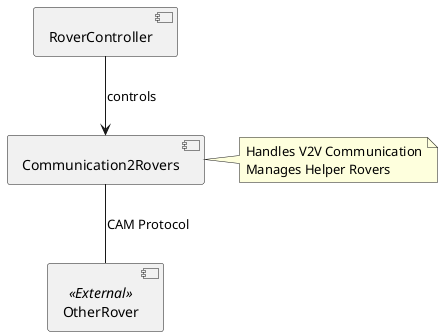

# Communication2Rovers コンポーネント仕様

## 概要
ローバー間通信（V2V）を管理するクラス。支援要請のブロードキャストや、他ローバーからの支援メッセージの受信を行います。

## 型定義 (Types)

### `RoverBroadcast`
*   **定義**: `record helperId: token, position: Position, fault: Fault, message: seq of char end`
*   **説明**: ローバー間通信のブロードキャストメッセージ。

## 定数定義 (Values)

### `camProtocol`
*   **値**: `mk_token("CAM")`
*   **説明**: 通信プロトコル。

## インスタンス変数と不変条件 (State & Invariants)

### 変数一覧
*   `registeredHelpers`: `set of token` := `{}`
    *   **説明**: 登録された支援ローバーのIDセット。
*   `pendingBroadcasts`: `seq of RoverBroadcast` := `[]`
    *   **説明**: 送信待ちのブロードキャストメッセージ。
*   `lastReceived`: `[RoverBroadcast]` := `nil`
    *   **説明**: 最後に受信したメッセージ。
*   `awaitingHelper`: `[token]` := `nil`
    *   **説明**: 到着を待っている支援ローバーのID。
*   `controller`: `[RoverController]` := `nil`
    *   **説明**: コントローラへの参照。

### 不変条件 (Invariant)
*   **式**: `awaitingHelper = nil or (let helper : token = awaitingHelper in helper in set registeredHelpers)`
*   **説明**: 支援待ちのローバーIDは登録済みであること。

## オペレーション一覧

### `setController(coord)`
*   **事前条件**: なし
*   **事後条件**: なし
*   **説明**: コントローラを設定します。
*   **関連要件**: コンポーネント間連携。

### `registerHelper(helperId)`
*   **事前条件**: なし
*   **事後条件**: なし
*   **説明**: 信頼できるヘルパーローバーのIDを登録します。
*   **関連要件**: 信頼関係管理。

### `broadcastStatus(helperId, pos, fault, payload, protocol)`
*   **事前条件**: `helperId in set registeredHelpers and protocol = camProtocol and payload <> []`
*   **事後条件**: `len pendingBroadcasts = len pendingBroadcasts~ + 1 and awaitingHelper = helperId`
*   **説明**: 指定されたヘルパーに対して支援要請をブロードキャストします。送信待ちキューに追加され、支援待ち状態になります。
*   **関連要件**: 支援要請、CAMプロトコル。

### `getPendingBroadcasts()`
*   **事前条件**: なし
*   **事後条件**: なし
*   **説明**: 送信待ちのブロードキャストを取得します。
*   **関連要件**: 送信処理。

### `consumeNextBroadcast()`
*   **事前条件**: なし
*   **事後条件**: 
    *   `(pendingBroadcasts~ = [] => RESULT = nil)`
    *   `(pendingBroadcasts~ <> [] => RESULT = hd pendingBroadcasts~ and pendingBroadcasts = tl pendingBroadcasts~)`
*   **説明**: 次のブロードキャストを取り出します。
*   **関連要件**: 送信処理。

### `receiveBroadcast(msg)`
*   **事前条件**: `msg.message <> [] and msg.helperId in set registeredHelpers`
*   **事後条件**: `lastReceived = msg and awaitingHelper = msg.helperId`
*   **説明**: ブロードキャストを受信します。
*   **関連要件**: 受信処理。

### `confirmHelperArrival(helperId)`
*   **事前条件**: `helperId in set registeredHelpers`
*   **事後条件**: `(awaitingHelper~ = helperId => awaitingHelper = nil)`
*   **説明**: ヘルパーローバーが到着した際に呼び出されます。待機中のヘルパーIDと一致すれば、到着を `RoverController` に報告し、待機状態を解除します。
*   **関連要件**: 支援到着確認。

### `getLastBroadcast()`
*   **事前条件**: なし
*   **事後条件**: なし
*   **説明**: 最後に受信したブロードキャストを取得します。
*   **関連要件**: 状態確認。

### `isAwaitingHelper()`
*   **事前条件**: なし
*   **事後条件**: なし
*   **説明**: 支援待ちかどうかを確認します。
*   **関連要件**: 状態確認。

## UMLモデル (PlantUML)

### 1. クラス図 (Class Diagram)
`Communication2Rovers` クラスの構造と、`RoverTypes` の継承関係を示します。

### 2. ステートマシン図 (State Machine Diagram)
支援ローバーの待機状態遷移を示します。

### 3. アクティビティ図 (Activity Diagram)
`broadcastStatus` におけるブロードキャスト送信ロジックを示します。

### 4. シーケンス図 (Sequence Diagram)
支援要請ブロードキャストから到着確認までのフローを示します。

### 5. コンポーネント図 (Component Diagram)
`Communication2Rovers` は `RoverController` によって制御され、他のローバーと通信します。

