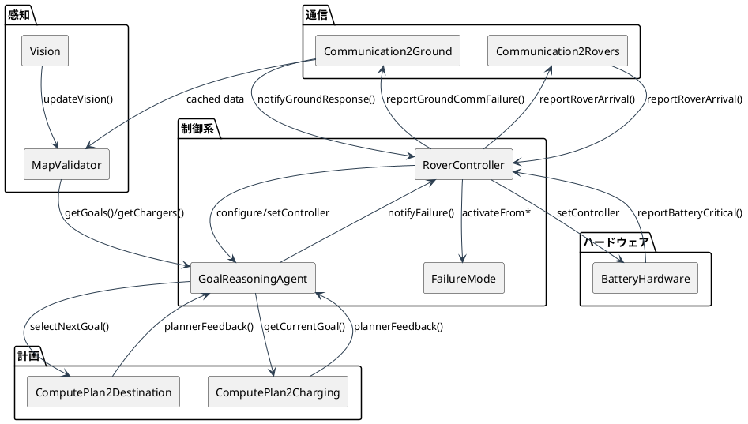
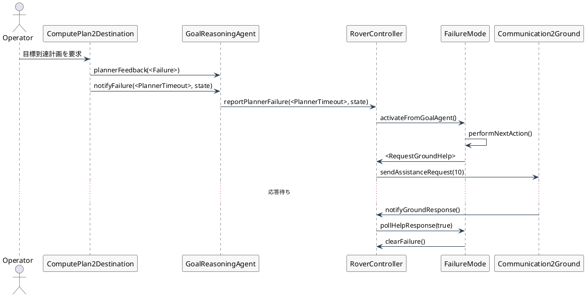
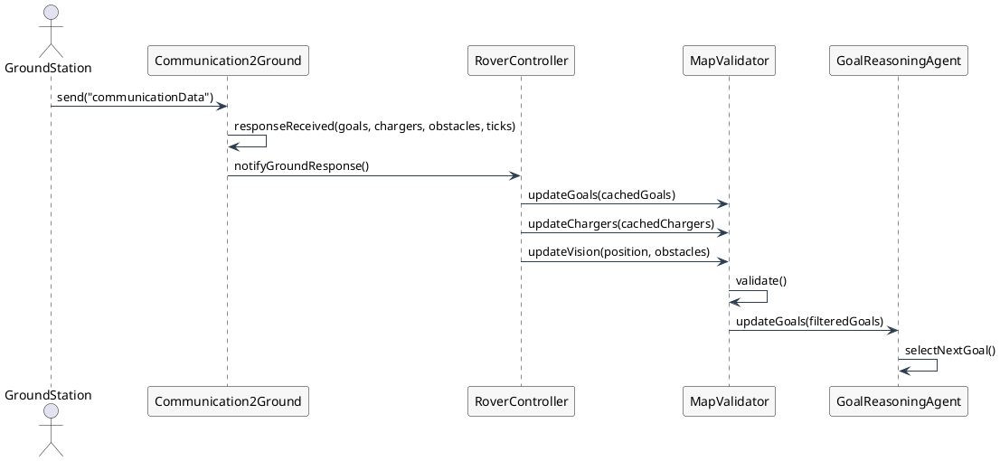
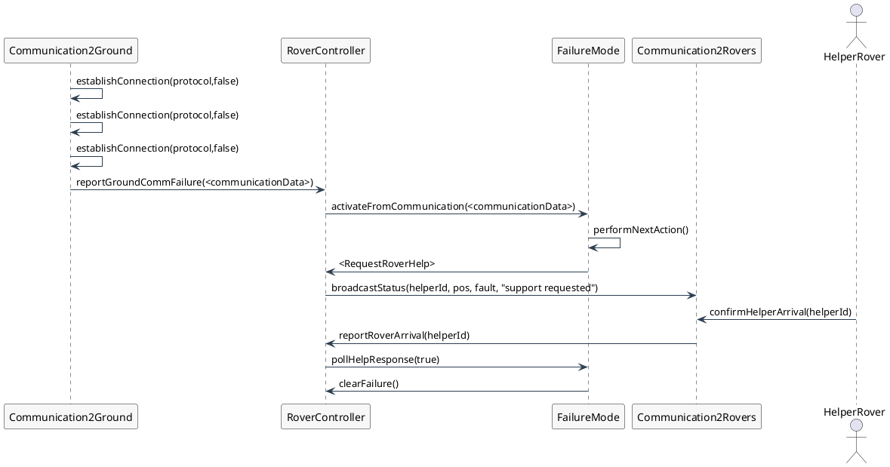
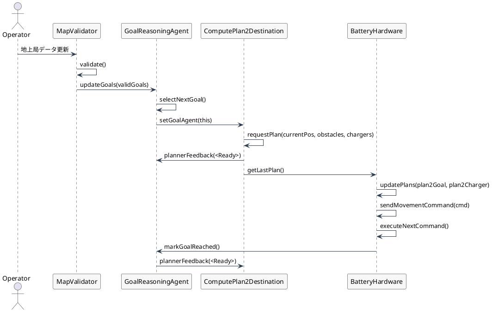
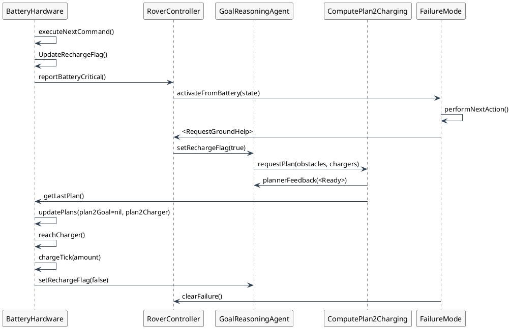

# ローバー VDM++ コンポーネント概要

本ドキュメントでは `rover_vdmpp/` 配下の VDM++ クラスについて、役割・主要操作・不変条件を日本語で整理し、コンポーネント間の連携を PlantUML で可視化する。

## コンポーネント一覧

| ファイル                            | 主な責務                                                     |
| ----------------------------------- | ------------------------------------------------------------ |
| `RoverTypes.vdmpp`                  | 共通の型・定数・汎用関数を定義するベースクラス               |
| `Vision.vdmpp`                      | センサ観測から位置と障害物を推定し、精度・許容誤差を検査する |
| `MapValidator.vdmpp`                | Vision と地上局データを突合し、障害物衝突を検出する          |
| `GoalReasoningAgent.vdmpp`          | 目標選択ロジックと故障通知のハブ                             |
| `ComputePlan2Destination.vdmpp`     | 目的地プラン生成および PRA 風のフィードバック処理            |
| `ComputePlan2Charging.vdmpp`        | 充電地点へのプラン生成と最寄り充電器探索                     |
| `BatteryHardware.vdmpp`             | バッテリ残量、移動コマンド、ソーラーパネル制御を統括         |
| `Communication2Ground.vdmpp`        | 地上局との接続管理・再接続・レスポンス処理                   |
| `Communication2Rovers.vdmpp`        | 他ローバーとの CAM 風ブロードキャストとヘルパー到着確認      |
| `FailureMode.vdmpp`                 | 故障診断と回復アクション選択、支援待機管理                   |
| `RoverController.vdmpp`             | コンポーネント間の連携をまとめる調整ファサード               |
| `VisionSpecificationTests.vdmpp`    | Vision 要件を検証するテストスイート                          |
| `BatteryHardwareTestSuite.vdmpp`    | BatteryHardware の動作を検証するテストスイート               |
| `CommunicationTestSuite.vdmpp`      | 通信コンポーネントの動作を検証するテストスイート             |
| `FailureModeTestSuite.vdmpp`        | 故障モードの動作を検証するテストスイート                     |
| `MapValidatorTestSuite.vdmpp`       | MapValidator の動作を検証するテストスイート                  |
| `GoalReasoningAgentTestSuite.vdmpp` | GoalReasoningAgent の動作を検証するテストスイート            |
| `PlannerTestSuite.vdmpp`            | プランナの動作を検証するテストスイート                       |
| `TestRunner.vdmpp`                  | 全テストスイートを統括して実行するランナー                   |
| `PlannerFailureScenario.vdmpp`      | 故障シナリオ定義のプレースホルダー                           |

## 各ファイルの詳細

### `RoverTypes.vdmpp`
- **役割**: すべてのクラスが継承する基底。目標 (`Goal`)、充電器 (`Charger`)、プラン (`Plan`)、システム状態 (`SystemState`) 等のレコードと、バッテリ容量や安全距離などの定数を定義。
- **主要関数**:
  - `optionalPlanLength` で `nil` 許容プランの長さを安全に取得。
  - `nearestCharger` が与えられた位置から最寄りの充電器を探索。
- **補足**: `Vision` の `dist` を再利用し、位置比較を統一している。

### `Vision.vdmpp`
- **役割**: センサ情報を統合し現在位置と障害物集合を推定。
- **不変条件**:
  - 識別精度 `accuracy` は常に 0.95 以上。
  - 現在位置と障害物との差は最低安全距離（1m）を維持。
- **主要操作**:
  - `updateSensor` でセンサ毎の観測を登録。
  - `processSensorData` で各読み取りを平均化し現在位置を推定。
  - `assertPositionTolerance` や `assertDetectionAccuracy` で要件 V4/V3 を満たすことを確認。

### `MapValidator.vdmpp`
- **役割**: Vision が検出した位置・障害物と、地上局からの目標/充電器一覧を照合し、衝突の有無を検証。
- **不変条件**: マップが `<Valid>` の場合、現在位置・目標・充電器はいずれも障害物と安全距離を保っている。
- **主要操作**:
  - `validate` が衝突を分析し `MapReport` を返す。衝突時は `<Invalid>` と詳細メッセージを生成。
  - `getValidatedObstacles` 等で検証済みデータを提供。

### `GoalReasoningAgent.vdmpp`
- **役割**: 目標選択、充電要求処理、ミッション完了判定、故障通知の受け口。
- **状態**: 目標リスト、現在目標、充電要求フラグ、安全地点 `safeLocation`、直近の故障情報などを保持。
- **主要操作**:
  - `selectNextGoal` が充電要求と安全地点を考慮し次の目標を決定。
  - `plannerFeedback` でプランナからの結果を記録し追加指示待ち状態を更新。
  - `notifyFailure` が故障理由と状態を `RoverController` にエスカレーション。
  - `setController` / `getLastKnownPosition` でコントローラとの連携を確立。

### `ComputePlan2Destination.vdmpp`
- **役割**: 現在位置と障害物情報から目的地への簡易プラン（開始点と終点）を生成。
- **挙動**:
  - GRA が未設定、または故障フラグが有効な場合は `<Failure>` を返却し、GRA に故障通知。
  - 目標地点が障害物と被る場合は `<NoPlan>` を返却。
  - 成功時は開始位置と目標位置からなる 2 点シーケンスの `Plan` を返却。

### `ComputePlan2Charging.vdmpp`
- **役割**: 現在目標から最寄り充電器までのプランを作成。
- **特徴**:
  - `nearestCharger` を使用し最適な充電器を選択。
  - 故障フラグが立っている場合は GRA に故障を通知。
  - 目標位置と充電器が同地点なら空のプラン (`[]`) を返却し、ローバーが既に充電地点にいることを示す。

### `BatteryHardware.vdmpp`
- **役割**: バッテリ残量管理、移動コマンドキュー、ソーラーパネル展開ロジックをまとめたコンポーネント。
- **不変条件**:
  - `batteryLevel <= maxBattery`、パネル展開時は充電器上にいる、充電中であれば充電器上にいる。
  - 目標・充電器に到達するための残ステップ合計がバッテリ残量を超える場合 `rechargeFlag` が正。
- **主要操作**:
  - `updatePlans` で目標・充電器プランのステップ数を反映し充電要否を再計算。
  - `executeNextCommand` がコマンド消費とバッテリ減少を処理し、枯渇時には `RoverController` へ `reportBatteryCritical`。
  - `reachCharger` / `chargeTick` により充電フローとパネル展開/収納を制御。

### `Communication2Ground.vdmpp`
- **役割**: 地上局との接続状態、再接続、レスポンスキャッシュ、失敗エスカレーションを管理。
- **不変条件**: 成功回数 ≤ 試行回数、接続中なら試行済み、エスカレーションした場合は連続失敗数 ≥ 3。
- **主要操作**:
  - `establishConnection` / `reconnect` で接続確立・再トライ。
  - `sendAssistanceRequest` が FailureMode からの支援要請を規定タイムアウト付きで送信。
  - `responseReceived` が地上局からのゴール／充電器／障害物情報をキャッシュし `RoverController` に通知。
  - 連続失敗が閾値に達すると `reportGroundCommFailure` を発火して FailureMode にエスカレーション。

### `Communication2Rovers.vdmpp`
- **役割**: CAM 風プロトコルを想定したヘルパーローバーとのブロードキャスト通信。
- **不変条件**: 待機中のヘルパー ID は登録済み集合に含まれる。
- **主要操作**:
  - `registerHelper` で信頼できるローバー ID を登録。
  - `broadcastStatus` が支援要請メッセージをキューに積み、当該ヘルパーを待機状態に。
  - `confirmHelperArrival` はヘルパー到着を検証し、成功時に `RoverController.reportRoverArrival` を通知。

### `FailureMode.vdmpp`
- **役割**: 故障情報とシステム状態を受け取り、回復アクション列を決定。支援待機時間を監視。
- **主要な状態**: 現在故障 (`currentFault`)、システム状態、回復アクションキュー、支援待機フラグ・経過ティック。
- **不変条件**: 故障が `<None>` の場合はアクションキューが空、支援要請中は必ず故障が存在。
- **主要操作**:
  - `activateFromGoalAgent` などで起動原因に応じたアクションをキュー化。
  - `performNextAction` がアクションを一つ取り出し、支援依頼時に GRA の安全地点設定を更新。
  - `pollHelpResponse` と `helpWaitExceeded` が支援応答監視とエスカレーション条件を提供。

### `RoverController.vdmpp`
- **役割**: 各コンポーネント間をつなぐ調整用ファサード。故障イベントの入り口と回復ループを集約。
- **主要機能**:
  - `configure` で GRA / BatteryHardware / Communication2Ground / Communication2Rovers / FailureMode を束ね `setController` を呼び出す。
  - `reportPlannerFailure`, `reportBatteryCritical`, `reportGroundCommFailure` が FailureMode を起動し回復処理を実行。
  - `tickHelpWait` が支援待機監視を進め、時間超過時にエスカレーション。
  - `attemptGroundHelp` / `attemptRoverHelp` が通信コンポーネントを通じて支援要請を実行。

### テスト・補助ファイル
- `VisionSpecificationTests.vdmpp`
  - **役割**: Vision 要件 V1〜V6 を検証する自動テストスイート。
  - **テストパターン**:
    - `TestV1_SupportsCameraAndLiDAR`: カメラと LiDAR の観測を受け付けて統合できるかを確認。
    - `TestV2_ReturnsCurrentPositionAndObstacles`: 推定位置と障害物集合が期待値と一致するかを検証。
    - `TestV3_AccuracyThreshold`: 識別精度が 95%以上であることを確認。
    - `TestV4_PositionNotOnObstacle`: 推定位置が障害物から安全距離を保っているかを確認。
    - `TestV5_PositionTolerance` / `TestV5_NegativeCase`: 真位置との距離が許容範囲内外で正しく判定されるかを検証。
    - `TestV6_LocalRobustness`: 入力を微小に変化させた場合でも推定位置が安定するかを確認。
- `BatteryHardwareTestSuite.vdmpp`
  - **役割**: バッテリーの消費、充電、コマンド実行ロジックを検証。
  - **テストパターン**: 初期化、移動による消費、充電器到達時の充電動作。
- `CommunicationTestSuite.vdmpp`
  - **役割**: 地上局およびローバー間通信の接続・送信ロジックを検証。
  - **テストパターン**: 地上局接続・メッセージ送信、ローバー間ブロードキャスト・ヘルパー待機。
- `FailureModeTestSuite.vdmpp`
  - **役割**: 故障発生時の状態遷移と回復アクション選択を検証。
  - **テストパターン**: バッテリー故障からの起動、回復アクション（地上局支援要請）の選択。
- `MapValidatorTestSuite.vdmpp`
  - **役割**: 地図データの整合性検証ロジックを確認。
  - **テストパターン**: 有効な地図（安全距離確保）、無効な地図（障害物との衝突）の判定。
- `GoalReasoningAgentTestSuite.vdmpp`
  - **役割**: ゴール選択の優先順位ロジックを検証。
  - **テストパターン**: 優先度に基づくゴール選択。
- `PlannerTestSuite.vdmpp`
  - **役割**: 目的地および充電器へのプラン生成ロジックを検証。
  - **テストパターン**: 目的地へのプラン生成、充電器へのプラン生成（GRA連携含む）。
- `TestRunner.vdmpp`
  - **役割**: 上記すべてのテストスイートを統括し、コンポーネントレベル・システムレベルで実行・結果出力を行う。
- `PlannerFailureScenario.vdmpp`
  - **役割**: 故障シナリオ定義のプレースホルダー。
  - **テストパターン**: 未作成。

## コンポーネント別テスト確認状況

| コンポーネント          | テストファイル                      | 主な検証内容                                                   |
| ----------------------- | ----------------------------------- | -------------------------------------------------------------- |
| Vision                  | `VisionSpecificationTests.vdmpp`    | センサ統合、推定位置・障害物の整合、精度、許容誤差、ロバスト性 |
| MapValidator            | `MapValidatorTestSuite.vdmpp`       | 障害物とゴール・充電器の安全距離検証                           |
| GoalReasoningAgent      | `GoalReasoningAgentTestSuite.vdmpp` | 優先度に基づくゴール選択ロジック                               |
| ComputePlan2Destination | `PlannerTestSuite.vdmpp`            | 目的地への経路生成（成功・失敗）                               |
| ComputePlan2Charging    | `PlannerTestSuite.vdmpp`            | 最寄り充電器への経路生成                                       |
| BatteryHardware         | `BatteryHardwareTestSuite.vdmpp`    | 消費、充電、コマンド実行                                       |
| Communication2Ground    | `CommunicationTestSuite.vdmpp`      | 接続管理、メッセージ送信                                       |
| Communication2Rovers    | `CommunicationTestSuite.vdmpp`      | ブロードキャスト、ヘルパー登録                                 |
| FailureMode             | `FailureModeTestSuite.vdmpp`        | 故障検知、回復アクション選択                                   |
| RoverController         | システムテストでカバー              | 各コンポーネントの連携（TestRunner参照）                       |

## テスト戦略と実行手順

### テストレベルの定義
テストは以下の2つのレベルに分けて管理・実行する。

1.  **コンポーネントレベルテスト**
    *   **目的**: 各コンポーネントが単体で仕様（契約）を満たしているか検証する。
    *   **対象**: `Vision`, `BatteryHardware`, `MapValidator`, `Communication`
    *   **実行コマンド**: `p new TestRunner().RunComponentTests()`

2.  **システムレベルテスト**
    *   **目的**: 複数のコンポーネントが連携し、システムとしての目標（ゴール選択、プランニング、故障回復）を達成できるか検証する。
    *   **対象**: `GoalReasoningAgent`, `Planner`, `FailureMode`
    *   **実行コマンド**: `p new TestRunner().RunSystemTests()`

### 全テストの実行
すべてのテストを一括で実行し、全体の結果を確認する場合は以下のコマンドを使用する。
*   **実行コマンド**: `p new TestRunner().RunAll()`

### テスト結果のテキスト出力手順
テスト結果、テストパターン、VDM++コードをインプットとして、より精度の高いドキュメント生成を行うために、以下の手順でテスト結果をテキストファイルとして保存することを推奨する。

1.  **コンソール出力の保存 (GUI/IDE利用時)**
    *   **VS Codeの場合**: コマンドパレット (`Ctrl+Shift+P`) から `VDM: Start Console` 等を選択して VDM コンソールを起動し、その中で `p new TestRunner().RunAll()` と入力する。
    *   **Overtureの場合**: Debug パースペクティブの Console ビューで入力する。
    *   出力結果をコピーしてテキストファイルに保存する。

2.  **コマンドラインからのリダイレクト (CLI利用時)**
    *   Windowsのコマンドプロンプトで直接 `p` コマンドは実行できない（`p` は VDM インタプリタ内部のコマンドであるため）。
    *   **一括実行と保存の例**:
        1.  プロジェクトフォルダに `run_tests.vdm` というファイルを作成し、以下の内容を保存する。
            ```text
            p new TestRunner().RunAll()
            quit
            ```
        2.  以下のコマンドを実行する。
            ```cmd
            java -jar vdmj-4.6.0-P.jar -vdmpp . < run_tests.vdm > TestResults.txt
            ```
    *   **注意**: `vdmj.jar` がカレントディレクトリに存在するか、パスが通っている必要がある。
    *   **vdmj.jar の入手と配置手順**:
        1.  GitHub の [overturetool/vdmj](https://github.com/overturetool/vdmj) リポジトリの Releases ページから最新の `.jar` ファイル（例: `vdmj-4.6.0-xxxx.jar`）をダウンロードする。
        2.  ダウンロードしたファイルを本プロジェクトの `rover_vdmpp` フォルダに配置する。
        3.  コマンド入力を簡単にするため、ファイル名を `vdmj.jar` に変更する。

## PlantUML による構造図

### コンポーネント連携図


## シナリオ別シーケンス図

### シナリオ1: プランナ故障に伴う地上局支援要請


プランナが `<Failure>` を返した場合に、故障情報が FailureMode に伝播し、地上局への支援要請と応答確認までを一貫して行う流れを表す。

### シナリオ2: 地上局からの最新マップ反映と目標再選択


通信復帰後に地上局から送られたマップ情報を取り込み、MapValidator が検証した結果に基づいて GRA が改めて目標を決定するシナリオを示す。実装では `Cached` データを利用して `update*` 操作を呼び出す箇所をオーケストレーションする必要がある。

### シナリオ3: 通信断が続いた場合のローバー支援要請


連続した再接続失敗が発生した際に FailureMode がローバー支援に切り替え、支援ローバーの到着確認を経て故障状態を解消するまでの経路を表現している。

### シナリオ4: ある地点から目標地点に向かう通常フロー


地上局や Vision から得た情報を基に MapValidator がマップを確認し、GRA が目標を選択。ComputePlan2Destination がプランを生成し BatteryHardware が移動コマンドを実行して目標に到達する平常時の流れを示す。

### シナリオ5: 移動中にバッテリ残量が不足した場合のリルート


バッテリ残量が不足した際に BatteryHardware が `reportBatteryCritical` を発火し、FailureMode を介して充電ルートに切り替えて再充電する流れを表している。

---
この概要とシナリオ例を基に、各コンポーネントの仕様や相互作用を俯瞰できる。実装を拡張する際は、PlantUML 図を随時更新し、シナリオ別のふるまいが仕様と整合しているか確認することを推奨する。
