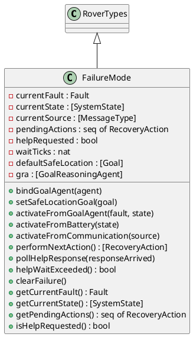
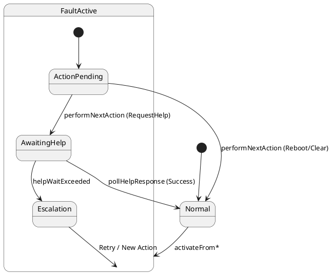
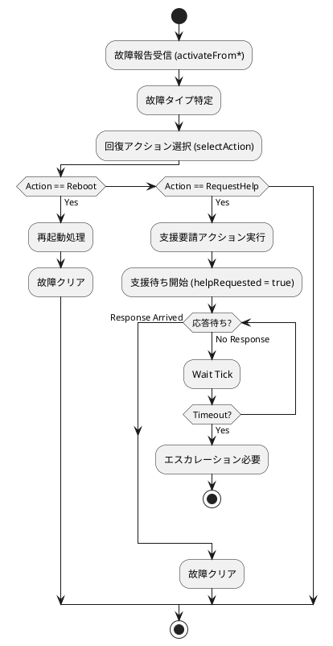
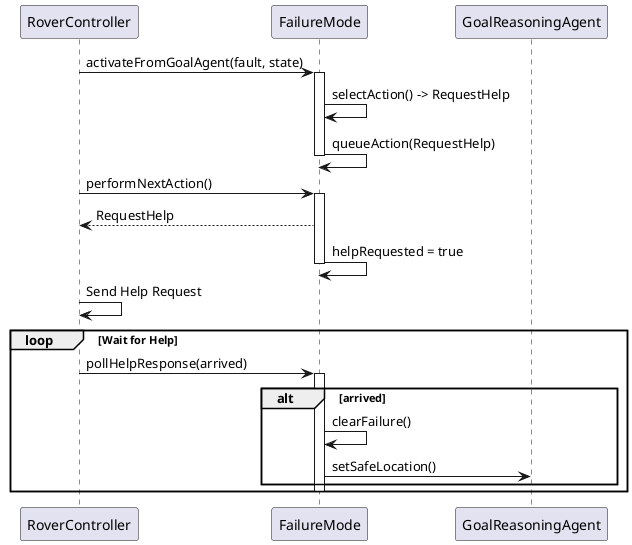
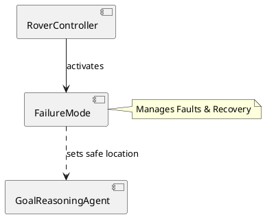

# FailureMode コンポーネント仕様

## 概要
システムの故障状態を管理し、適切な回復アクション（リブート、支援要請など）を決定するクラス。

## 型定義 (Types)

### `FailureEvent`
*   **定義**: `record fault: Fault, state: [SystemState], source: [MessageType] end`
*   **説明**: 障害イベント構造体。

## 定数定義 (Values)

### `helpCheckLimit`
*   **値**: `100`
*   **説明**: 支援待ちの制限時間。

## インスタンス変数と不変条件 (State & Invariants)

### 変数一覧
*   `currentFault`: `Fault` := `<None>`
    *   **説明**: 現在発生している障害。
*   `currentState`: `[SystemState]` := `nil`
    *   **説明**: 障害発生時のシステム状態。
*   `currentSource`: `[MessageType]` := `nil`
    *   **説明**: 障害の原因となったメッセージタイプ。
*   `pendingActions`: `seq of RecoveryAction` := `[]`
    *   **説明**: 実行待ちの回復アクション。
*   `helpRequested`: `bool` := `false`
    *   **説明**: 支援要請済みフラグ。
*   `waitTicks`: `nat` := `0`
    *   **説明**: 待機時間カウンタ。
*   `defaultSafeLocation`: `[Goal]` := `nil`
    *   **説明**: デフォルトの安全退避場所。
*   `gra`: `[GoalReasoningAgent]` := `nil`
    *   **説明**: GoalReasoningAgentへの参照。

### 不変条件 (Invariant)
*   **式**: `(currentFault = <None> => pendingActions = [])`
*   **説明**: 障害がない場合はアクションもない。
*   **式**: `(helpRequested => currentFault <> <None>)`
*   **説明**: 支援要請中は障害が発生していること。

## オペレーション一覧

### `selectAction(fault, source)`
*   **事前条件**: なし
*   **事後条件**: なし
*   **説明**: 障害の種類と原因に基づいて回復アクションを選択する内部関数。
*   **関連要件**: 回復戦略決定。

### `bindGoalAgent(agent)`
*   **事前条件**: なし
*   **事後条件**: なし
*   **説明**: GoalReasoningAgentをバインドします。
*   **関連要件**: コンポーネント間連携。

### `setSafeLocationGoal(goal)`
*   **事前条件**: なし
*   **事後条件**: なし
*   **説明**: 安全退避場所を設定し、GRAにも通知します。
*   **関連要件**: 安全確保。

### `applySafeLocation()`
*   **事前条件**: なし
*   **事後条件**: なし
*   **説明**: 安全退避場所を適用する内部操作。
*   **関連要件**: 安全確保。

### `queueAction(action)`
*   **事前条件**: なし
*   **事後条件**: なし
*   **説明**: 回復アクションをキューに追加する内部操作。
*   **関連要件**: アクション管理。

### `activateFromGoalAgent(fault, state)`
*   **事前条件**: なし
*   **事後条件**: `currentFault = fault and pendingActions = [selectAction(fault, nil)] ...`
*   **説明**: GRAからの故障報告（プランニングタイムアウト等）を処理します。故障タイプに応じた回復アクションを選択しキューに追加します。
*   **関連要件**: 故障診断、回復戦略。

### `activateFromBattery(state)`
*   **事前条件**: なし
*   **事後条件**: `currentFault = <LocalizationFault> and pendingActions = [<RequestGroundHelp>] ...`
*   **説明**: バッテリー切れ報告を処理します。`<LocalizationFault>` として扱い、`<RequestGroundHelp>` を選択します。
*   **関連要件**: バッテリー故障対応。

### `activateFromCommunication(source)`
*   **事前条件**: なし
*   **事後条件**: `currentFault = <CommFailure> and pendingActions = [selectAction(<CommFailure>, source)] ...`
*   **説明**: 通信障害報告を処理します。`<CommFailure>` として扱い、状況に応じて `<RequestRoverHelp>` または `<RequestGroundHelp>` を選択します。
*   **関連要件**: 通信故障対応。

### `performNextAction()`
*   **事前条件**: なし
*   **事後条件**: なし
*   **説明**: キューにある次の回復アクションを取り出して返します。支援要請アクションの場合は、支援待ち状態 (`helpRequested`) に移行します。
*   **関連要件**: 回復実行。

### `pollHelpResponse(responseArrived)`
*   **事前条件**: なし
*   **事後条件**: なし
*   **説明**: 支援応答があったかどうかを確認します。応答があれば故障状態をクリアします。
*   **関連要件**: 支援監視。

### `helpWaitExceeded()`
*   **事前条件**: なし
*   **事後条件**: なし
*   **説明**: 支援待ち時間が超過したか確認します。
*   **関連要件**: タイムアウト監視。

### `clearFailure()`
*   **事前条件**: なし
*   **事後条件**: なし
*   **説明**: 障害状態をクリアします。
*   **関連要件**: 正常復帰。

### `getCurrentFault()`
*   **事前条件**: なし
*   **事後条件**: なし
*   **説明**: 現在の障害を取得します。
*   **関連要件**: 状態確認。

### `getCurrentState()`
*   **事前条件**: なし
*   **事後条件**: なし
*   **説明**: 現在の状態を取得します。
*   **関連要件**: 状態確認。

### `getPendingActions()`
*   **事前条件**: なし
*   **事後条件**: なし
*   **説明**: 実行待ちのアクションを取得します。
*   **関連要件**: 状態確認。

### `isHelpRequested()`
*   **事前条件**: なし
*   **事後条件**: なし
*   **説明**: 支援要請中かどうかを取得します。
*   **関連要件**: 状態確認。

## UMLモデル (PlantUML)

### 1. クラス図 (Class Diagram)
`FailureMode` クラスの構造と、`RoverTypes` の継承関係を示します。

### 2. ステートマシン図 (State Machine Diagram)
故障状態の管理と回復プロセスの遷移を示します。

### 3. アクティビティ図 (Activity Diagram)
故障検知から回復アクション実行までのフローを示します。

### 4. シーケンス図 (Sequence Diagram)
故障発生から回復までの流れを示します。

### 5. コンポーネント図 (Component Diagram)
`FailureMode` は `RoverController` によって管理され、`GoalReasoningAgent` と連携します。

