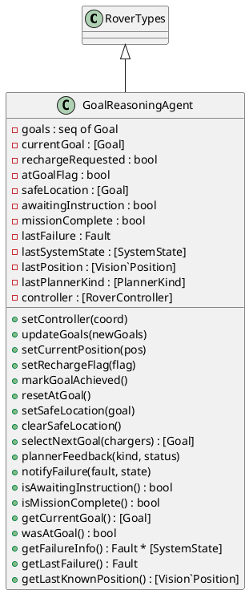
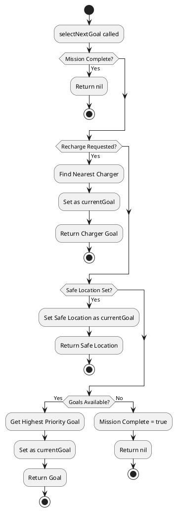
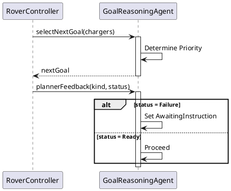
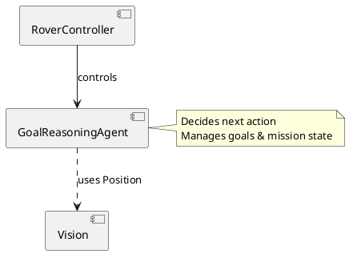

# GoalReasoningAgent コンポーネント仕様

## 概要
ゴール選択、充電要求の管理、ミッション完了判定を行うエージェントクラス。優先度付きゴールリストを管理し、状況に応じて次の行動を決定します。

## 型定義 (Types)
なし（`RoverTypes` を継承）

## 定数定義 (Values)
なし

## インスタンス変数と不変条件 (State & Invariants)

### 変数一覧
*   `goals`: `seq of Goal` := `[]`
    *   **説明**: 優先度順にソートされたゴールリスト。
*   `currentGoal`: `[Goal]` := `nil`
    *   **説明**: 現在選択されているゴール。
*   `rechargeRequested`: `bool` := `false`
    *   **説明**: 充電要求フラグ（trueなら充電が必要）。
*   `atGoalFlag`: `bool` := `false`
    *   **説明**: 現在のゴールに到達したかどうかのフラグ。
*   `safeLocation`: `[Goal]` := `nil`
    *   **説明**: 故障時に退避すべき安全地点。
*   `awaitingInstruction`: `bool` := `false`
    *   **説明**: 外部からの指示待ち状態かどうか。
*   `missionComplete`: `bool` := `false`
    *   **説明**: 全ミッション完了フラグ。
*   `lastFailure`: `Fault` := `<None>`
    *   **説明**: 最後に発生した故障の種類。
*   `lastSystemState`: `[SystemState]` := `nil`
    *   **説明**: 故障時のシステム状態。
*   `lastPosition`: `[Vision`Position]` := `nil`
    *   **説明**: 最後に記録されたローバーの位置。
*   `lastPlannerKind`: `[PlannerKind]` := `nil`
    *   **説明**: 最後に使用されたプランナーの種類。
*   `controller`: `[RoverController]` := `nil`
    *   **説明**: コントローラへの参照。

### 不変条件 (Invariant)
なし

## オペレーション一覧

### `isSorted(gs)`
*   **事前条件**: なし
*   **事後条件**: なし
*   **説明**: ゴールリストが優先度順（降順または昇順）であることを確認する内部関数。
*   **関連要件**: データ整合性。

### `removeGoal(g, gs)`
*   **事前条件**: なし
*   **事後条件**: なし
*   **説明**: 指定されたゴールをリストから削除する内部関数。
*   **関連要件**: リスト操作。

### `setController(coord)`
*   **事前条件**: なし
*   **事後条件**: なし
*   **説明**: コントローラを設定します。
*   **関連要件**: コンポーネント間連携。

### `updateGoals(newGoals)`
*   **事前条件**: `isSorted(newGoals)` (新しいゴールリストはソート済みであること)
*   **事後条件**: `goals = newGoals and (goals = [] => missionComplete)` (ゴールリストが更新され、空ならミッション完了となること)
*   **説明**: ゴールリストを更新します。
*   **関連要件**: ミッション管理。

### `setCurrentPosition(pos)`
*   **事前条件**: なし
*   **事後条件**: `lastPosition = pos`
*   **説明**: 現在位置を更新します（プランニング用）。
*   **関連要件**: 位置情報の追跡。

### `setRechargeFlag(flag)`
*   **事前条件**: なし
*   **事後条件**: `rechargeRequested = flag`
*   **説明**: 充電要求フラグを設定します。
*   **関連要件**: バッテリー管理連携。

### `markGoalAchieved()`
*   **事前条件**: なし
*   **事後条件**: `atGoalFlag and currentGoal = nil`
*   **説明**: 現在のゴールに到達したことをマークし、リストから削除します。
*   **関連要件**: ゴール達成処理。

### `resetAtGoal()`
*   **事前条件**: なし
*   **事後条件**: `not atGoalFlag`
*   **説明**: 到達フラグをリセットします。
*   **関連要件**: 状態リセット。

### `setSafeLocation(goal)`
*   **事前条件**: なし
*   **事後条件**: `safeLocation = goal`
*   **説明**: 安全退避地点を設定します。
*   **関連要件**: 故障回復、安全確保。

### `clearSafeLocation()`
*   **事前条件**: なし
*   **事後条件**: `safeLocation = nil`
*   **説明**: 安全退避地点をクリアします。
*   **関連要件**: 状態リセット。

### `selectNextGoal(chargers)`
*   **事前条件**: なし
*   **事後条件**: `RESULT = currentGoal`
*   **説明**: 次の目標地点を決定して返します。優先順位は ミッション完了 -> 充電要求 -> 安全退避 -> 通常ゴール です。
*   **関連要件**: 自律的な意思決定。

### `plannerFeedback(kind, status)`
*   **事前条件**: なし
*   **事後条件**: なし
*   **説明**: プランナーからのフィードバックを受け取ります。失敗時は指示待ち状態になります。
*   **関連要件**: プランニング結果の処理。

### `notifyFailure(fault, state)`
*   **事前条件**: なし
*   **事後条件**: なし
*   **説明**: 故障を通知し、コントローラに報告します。
*   **関連要件**: 故障検知とエスカレーション。

### `isAwaitingInstruction()`
*   **事前条件**: なし
*   **事後条件**: なし
*   **説明**: 指示待ち状態かどうかを返します。
*   **関連要件**: 状態確認。

### `isMissionComplete()`
*   **事前条件**: なし
*   **事後条件**: なし
*   **説明**: ミッション完了状態かどうかを返します。
*   **関連要件**: ミッション進捗確認。

### `getCurrentGoal()`
*   **事前条件**: なし
*   **事後条件**: なし
*   **説明**: 現在のゴールを返します。
*   **関連要件**: 情報提供。

### `wasAtGoal()`
*   **事前条件**: なし
*   **事後条件**: なし
*   **説明**: 直前にゴールに到達したかどうかを返します。
*   **関連要件**: 状態確認。

### `getFailureInfo()`
*   **事前条件**: なし
*   **事後条件**: なし
*   **説明**: 故障情報を返します。
*   **関連要件**: 診断情報提供。

### `getLastFailure()`
*   **事前条件**: なし
*   **事後条件**: なし
*   **説明**: 最後の故障種類を返します。
*   **関連要件**: 診断情報提供。

### `getLastKnownPosition()`
*   **事前条件**: なし
*   **事後条件**: なし
*   **説明**: 最後に記録された位置を返します。
*   **関連要件**: 情報提供。

## UMLモデル (PlantUML)

### 1. クラス図 (Class Diagram)
`GoalReasoningAgent` クラスの構造と、`RoverTypes` の継承関係を示します。



### 2. ステートマシン図 (State Machine Diagram)
エージェントのゴール選択状態遷移を示します。

```plantuml
@startuml
[*] --> Idle

state Idle {
  [*] --> CheckingConditions
  CheckingConditions --> MissionComplete : Goals Empty & No Recharge
  CheckingConditions --> SelectCharging : Recharge Requested
  CheckingConditions --> SelectSafeLocation : Safe Location Set
  CheckingConditions --> SelectNextGoal : Goals Available
}

state SelectCharging {
  entry / Find Nearest Charger
}

state SelectSafeLocation {
  entry / Set Safe Location as Goal
}

state SelectNextGoal {
  entry / Pop Highest Priority Goal
}

state MissionComplete {
}

state AwaitingInstruction {
  note right: Planner Failure or No Plan
}

SelectCharging --> Active : Goal Set
SelectSafeLocation --> Active : Goal Set
SelectNextGoal --> Active : Goal Set

Active --> Idle : Goal Reached
Active --> AwaitingInstruction : Plan Failure

AwaitingInstruction --> Idle : New Goals / Reset
@enduml
```

### 3. アクティビティ図 (Activity Diagram)
`selectNextGoal` における意思決定ロジックを示します。



### 4. シーケンス図 (Sequence Diagram)
ゴール選択とプランナーへのフィードバックの流れを示します。



### 5. コンポーネント図 (Component Diagram)
`GoalReasoningAgent` は `RoverController` と連携し、`Vision` の位置情報を利用します。



