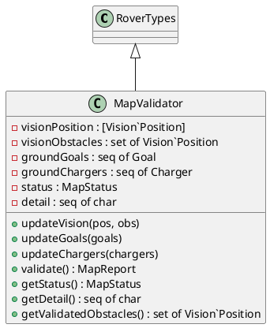
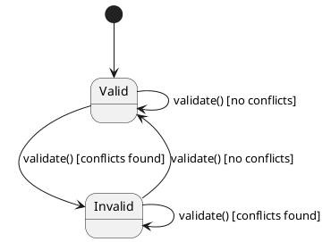
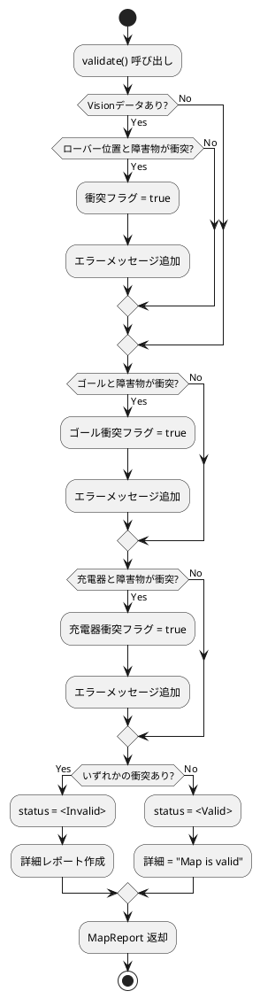
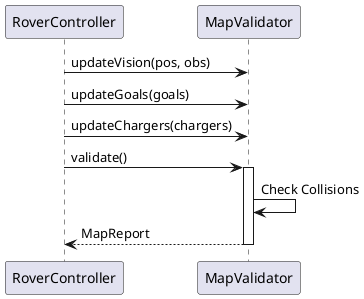
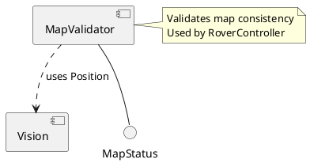

# MapValidator コンポーネント仕様

## 概要
Visionから得られた情報と地上局からの情報を統合し、地図の整合性を検証するクラス。

## 型定義 (Types)
なし（`RoverTypes` を継承）

## 定数定義 (Values)
なし

## インスタンス変数と不変条件 (State & Invariants)

### 変数一覧
*   `visionPosition`: `[Vision`Position]` := `nil`
    *   **説明**: Visionから取得した現在位置。
*   `visionObstacles`: `set of Vision`Position` := `{}`
    *   **説明**: Visionから取得した障害物セット。
*   `groundGoals`: `seq of Goal` := `[]`
    *   **説明**: 地上局から受信したゴールリスト。
*   `groundChargers`: `seq of Charger` := `[]`
    *   **説明**: 地上局から受信した充電器リスト。
*   `status`: `MapStatus` := `<Valid>`
    *   **説明**: 地図の検証状態（Valid/Invalid）。
*   `detail`: `seq of char` := `""`
    *   **説明**: 検証結果の詳細メッセージ。

### 不変条件 (Invariant)
*   **式**: `status = <Valid> => ...`
*   **説明**: ステータスがValidならば、ローバー、ゴール、充電器と障害物の間で安全距離が確保されていること。

## オペレーション一覧

### `updateVision(pos, obs)`
*   **事前条件**: なし
*   **事後条件**: なし
*   **説明**: Visionから得られた現在位置と障害物情報を更新します。
*   **関連要件**: 最新の環境認識情報の反映。

### `updateGoals(goals)`
*   **事前条件**: なし
*   **事後条件**: なし
*   **説明**: 地上局から受信したゴールリストを更新します。
*   **関連要件**: ミッション情報の更新。

### `updateChargers(chargers)`
*   **事前条件**: なし
*   **事後条件**: なし
*   **説明**: 地上局から受信した充電器リストを更新します。
*   **関連要件**: インフラ情報の更新。

### `validate()`
*   **事前条件**: なし
*   **事後条件**: 
    *   `RESULT.status = <Valid> <=> ((visionPosition <> nil => forall obs in set visionObstacles & Vision'dist(visionPosition, obs) >= safeDistance) and ...)`
    *   戻り値のステータスがValidであることと、全ての安全距離条件が満たされていることは同値。
*   **説明**: 現在のデータに基づいて地図の整合性を検証し、レポート (`MapReport`) を返します。ローバー、ゴール、充電器が障害物と安全距離を保っているか確認します。
*   **関連要件**: 安全性検証、衝突回避。

### `getStatus()`
*   **事前条件**: なし
*   **事後条件**: なし
*   **説明**: 現在のマップ検証ステータスを取得します。
*   **関連要件**: 状態確認。

### `getDetail()`
*   **事前条件**: なし
*   **事後条件**: なし
*   **説明**: 検証結果の詳細メッセージを取得します。
*   **関連要件**: エラー診断。

### `getValidatedObstacles()`
*   **事前条件**: `status = <Valid>`
*   **事後条件**: なし
*   **説明**: 検証済みの障害物セットを取得します。
*   **関連要件**: 安全な障害物情報の提供。

### `getCurrentPosition()`
*   **事前条件**: `visionPosition <> nil`
*   **事後条件**: なし
*   **説明**: 検証済みの現在位置を取得します。
*   **関連要件**: 位置情報の提供。

### `getGoals()`
*   **事前条件**: なし
*   **事後条件**: なし
*   **説明**: 現在のゴールリストを取得します。
*   **関連要件**: ゴール情報の提供。

### `getChargers()`
*   **事前条件**: なし
*   **事後条件**: なし
*   **説明**: 現在の充電器リストを取得します。
*   **関連要件**: 充電器情報の提供。

## UMLモデル (PlantUML)

### 1. クラス図 (Class Diagram)
`MapValidator` クラスの構造と、`RoverTypes` の継承関係を示します。

### 2. ステートマシン図 (State Machine Diagram)
地図データの検証状態の遷移を示します。

### 3. アクティビティ図 (Activity Diagram)
地図データの整合性検証 (`validate`) のロジックを示します。

### 4. シーケンス図 (Sequence Diagram)
データの更新から検証までの流れを示します。

### 5. コンポーネント図 (Component Diagram)
`MapValidator` は `Vision` のデータ型に依存し、`RoverController` から利用されます。

