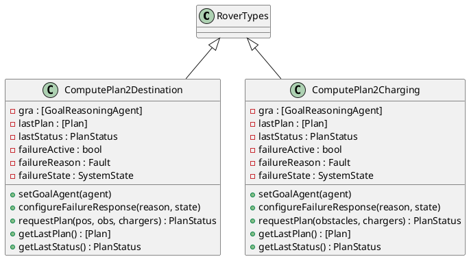
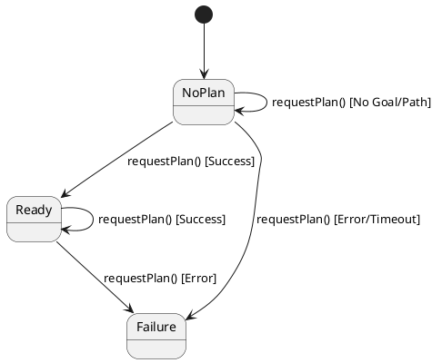
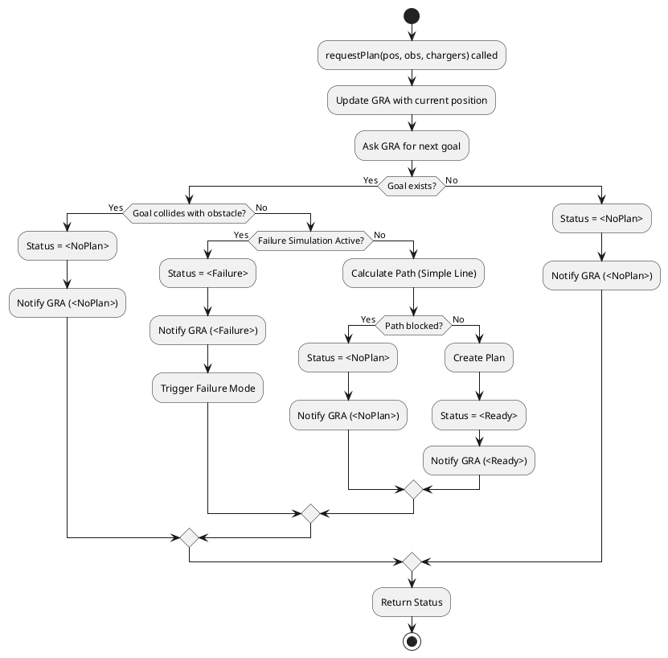
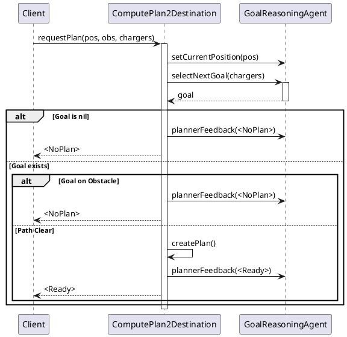
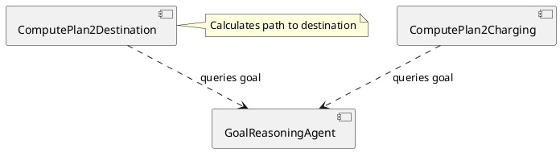

# Planner コンポーネント仕様

## 概要
目的地および充電ステーションへの移動プランを生成するクラス群。`ComputePlan2Destination` と `ComputePlan2Charging` の2つのクラスで構成されます。

## 型定義 (Types)
なし（`RoverTypes` を継承）

## 定数定義 (Values)
なし

## インスタンス変数と不変条件 (State & Invariants)

### ComputePlan2Destination 変数一覧
*   `gra`: `[GoalReasoningAgent]` := `nil`
    *   **説明**: ゴール推論エージェントへの参照。
*   `lastPlan`: `[Plan]` := `nil`
    *   **説明**: 最後に生成されたプラン。
*   `lastStatus`: `PlanStatus` := `<NoPlan>`
    *   **説明**: 最後のプラン生成ステータス。
*   `failureActive`: `bool` := `false`
    *   **説明**: 故障モードシミュレーション用フラグ。
*   `failureReason`: `Fault` := `<PlannerTimeout>`
    *   **説明**: シミュレートする故障の種類。
*   `failureState`: `SystemState` := `mk_SystemState(0, true, nil)`
    *   **説明**: 故障時のシステム状態。

### ComputePlan2Charging 変数一覧
*   `gra`: `[GoalReasoningAgent]` := `nil`
    *   **説明**: ゴール推論エージェントへの参照。
*   `lastPlan`: `[Plan]` := `nil`
    *   **説明**: 最後に生成されたプラン。
*   `lastStatus`: `PlanStatus` := `<NoPlan>`
    *   **説明**: 最後のプラン生成ステータス。
*   `failureActive`: `bool` := `false`
    *   **説明**: 故障モードシミュレーション用フラグ。
*   `failureReason`: `Fault` := `<PlannerTimeout>`
    *   **説明**: シミュレートする故障の種類。
*   `failureState`: `SystemState` := `mk_SystemState(0, true, nil)`
    *   **説明**: 故障時のシステム状態。

### 不変条件 (Invariant)
なし

## オペレーション一覧

### ComputePlan2Destination

#### `setGoalAgent(agent)`
*   **事前条件**: なし
*   **事後条件**: なし
*   **説明**: ゴール推論エージェントを設定します。
*   **関連要件**: 依存性注入。

#### `setFailureMode(flag)`
*   **事前条件**: なし
*   **事後条件**: なし
*   **説明**: 故障モードを有効化/無効化します（テスト用）。
*   **関連要件**: テスト容易性。

#### `configureFailureResponse(reason, state)`
*   **事前条件**: なし
*   **事後条件**: なし
*   **説明**: 故障時の応答を設定します（テスト用）。
*   **関連要件**: テスト容易性。

#### `requestPlan(currentPos, obstacles, chargers)`
*   **事前条件**: なし
*   **事後条件**: 
    *   `status = <Ready> => lastPlan <> nil and len lastPlan.steps >= 2`
    *   `status = <Failure> => lastPlan = nil`
    *   `status = <NoPlan> => lastPlan = nil`
*   **説明**: 現在位置から、GRAが選択した次のゴールへの経路を計算します。
*   **関連要件**: 経路生成、障害物回避。

#### `getLastPlan()`
*   **事前条件**: なし
*   **事後条件**: なし
*   **説明**: 最後に生成されたプランを取得します。
*   **関連要件**: 結果取得。

#### `getLastStatus()`
*   **事前条件**: なし
*   **事後条件**: なし
*   **説明**: 最後のステータスを取得します。
*   **関連要件**: 結果取得。

### ComputePlan2Charging

#### `setGoalAgent(agent)`
*   **事前条件**: なし
*   **事後条件**: なし
*   **説明**: ゴール推論エージェントを設定します。
*   **関連要件**: 依存性注入。

#### `setFailureMode(flag)`
*   **事前条件**: なし
*   **事後条件**: なし
*   **説明**: 故障モードを有効化/無効化します（テスト用）。
*   **関連要件**: テスト容易性。

#### `configureFailureResponse(reason, state)`
*   **事前条件**: なし
*   **事後条件**: なし
*   **説明**: 故障時の応答を設定します（テスト用）。
*   **関連要件**: テスト容易性。

#### `requestPlan(obstacles, chargers)`
*   **事前条件**: なし
*   **事後条件**: 
    *   `status = <Ready> => lastPlan <> nil`
    *   `status = <Failure> => lastPlan = nil`
    *   `status = <NoPlan> => lastPlan = nil`
*   **説明**: 現在の目標（通常はGRAによって設定された充電器の位置）への経路を計算します。
*   **関連要件**: 充電経路生成、障害物回避。

#### `getLastPlan()`
*   **事前条件**: なし
*   **事後条件**: なし
*   **説明**: 最後に生成されたプランを取得します。
*   **関連要件**: 結果取得。

#### `getLastStatus()`
*   **事前条件**: なし
*   **事後条件**: なし
*   **説明**: 最後のステータスを取得します。
*   **関連要件**: 結果取得。

## UMLモデル (PlantUML)

### 1. クラス図 (Class Diagram)
プランナー関連クラスの構造を示します。

### 2. ステートマシン図 (State Machine Diagram)
プランナーはリクエストごとに処理を行うため、永続的な複雑な状態遷移は持ちませんが、プラン生成の状態遷移を示します。

### 3. アクティビティ図 (Activity Diagram)
`ComputePlan2Destination` における `requestPlan` のロジックを示します。

### 4. シーケンス図 (Sequence Diagram)
プラン生成リクエスト (`requestPlan`) の処理フローを示します。

### 5. コンポーネント図 (Component Diagram)
プランナーは `GoalReasoningAgent` と密接に連携します。

