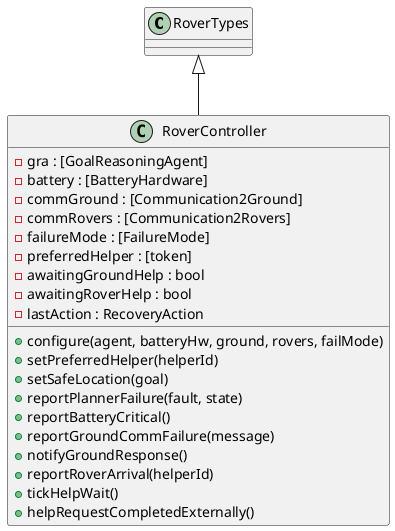
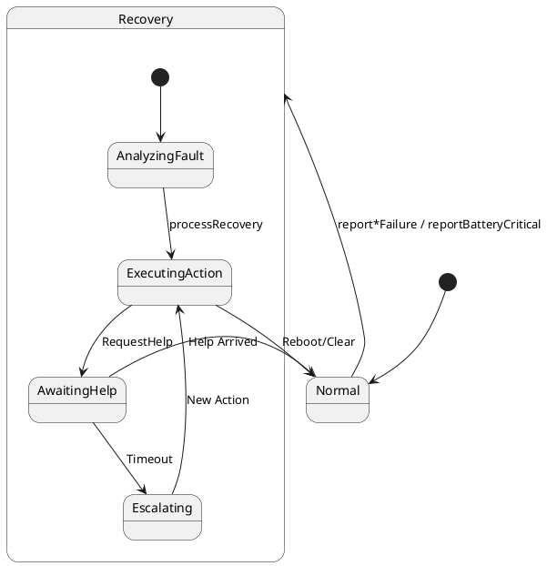
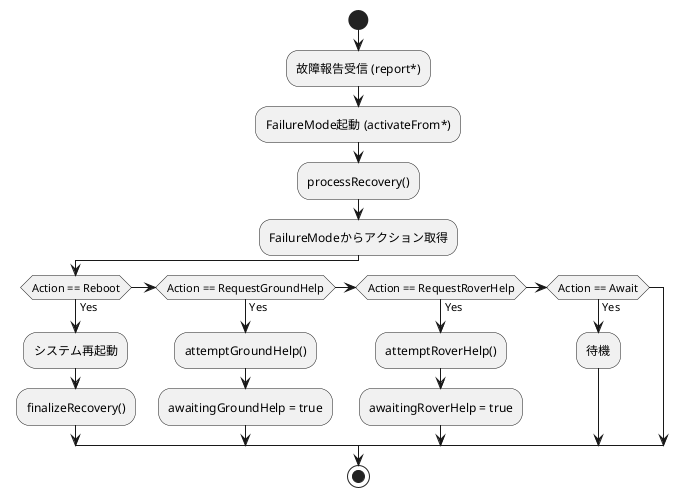
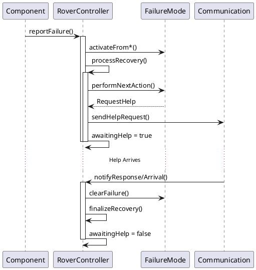
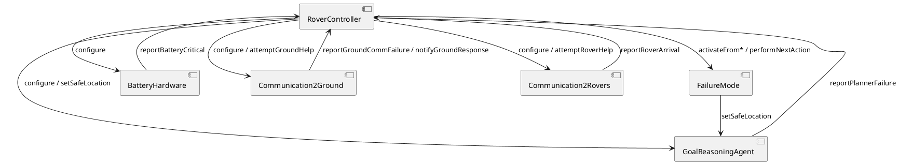

# RoverController コンポーネント仕様

## 概要
ローバー全体の制御を行うメインコントローラクラス。各コンポーネント（GRA, Battery, Communication, FailureMode）間の連携を調整します。

## 型定義 (Types)
なし（`RoverTypes` を継承）

## 定数定義 (Values)
なし

## インスタンス変数と不変条件 (State & Invariants)

### 変数一覧
*   `gra`: `[GoalReasoningAgent]` := `nil`
    *   **説明**: ゴール推論エージェントへの参照。
*   `battery`: `[BatteryHardware]` := `nil`
    *   **説明**: バッテリーハードウェアへの参照。
*   `commGround`: `[Communication2Ground]` := `nil`
    *   **説明**: 地上局通信モジュールへの参照。
*   `commRovers`: `[Communication2Rovers]` := `nil`
    *   **説明**: ローバー間通信モジュールへの参照。
*   `failureMode`: `[FailureMode]` := `nil`
    *   **説明**: 故障モード管理モジュールへの参照。
*   `preferredHelper`: `[token]` := `nil`
    *   **説明**: 優先的に支援を要請するヘルパーローバーのID。
*   `awaitingGroundHelp`: `bool` := `false`
    *   **説明**: 地上局への支援要請中フラグ。
*   `awaitingRoverHelp`: `bool` := `false`
    *   **説明**: 他ローバーへの支援要請中フラグ。
*   `lastAction`: `RecoveryAction` := `<Await>`
    *   **説明**: 最後に実行した回復アクション。

### 不変条件 (Invariant)
*   **式**: `(failureMode = nil => gra = nil)`
    *   **説明**: 故障モードがない場合はGRAも設定されていない（初期化整合性）。
*   **式**: `not (awaitingGroundHelp and awaitingRoverHelp)`
    *   **説明**: 地上局と他ローバーへの支援要請は同時に行わない。

## オペレーション一覧

### `configure(agent, batteryHw, ground, rovers, failMode)`
*   **事前条件**: なし
*   **事後条件**: `gra = agent and battery = batteryHw ...` (各インスタンス変数が正しく設定されること)
*   **説明**: システムの各コンポーネントへの参照を保持し、相互リンクを確立します。
*   **関連要件**: システム初期化、依存性注入。

### `setPreferredHelper(helperId)`
*   **事前条件**: なし
*   **事後条件**: `preferredHelper = helperId`
*   **説明**: 優先ヘルパーローバーを設定します。
*   **関連要件**: 支援設定。

### `setSafeLocation(goal)`
*   **事前条件**: なし
*   **事後条件**: なし
*   **説明**: 安全な退避場所を設定します。
*   **関連要件**: 安全確保。

### `reportPlannerFailure(fault, state)`
*   **事前条件**: なし
*   **事後条件**: なし
*   **説明**: プランナーからの失敗報告を受け取り、`FailureMode` を起動した後、回復プロセスを開始します。
*   **関連要件**: 故障対応（プランニング）。

### `reportBatteryCritical()`
*   **事前条件**: なし
*   **事後条件**: なし
*   **説明**: バッテリー切れの報告を受け取り、`FailureMode` を起動した後、回復プロセスを開始します。
*   **関連要件**: 故障対応（バッテリー）。

### `reportGroundCommFailure(message)`
*   **事前条件**: なし
*   **事後条件**: なし
*   **説明**: 地上局通信の失敗報告を受け取り、`FailureMode` を起動した後、回復プロセスを開始します。
*   **関連要件**: 故障対応（通信）。

### `notifyGroundResponse()`
*   **事前条件**: なし
*   **事後条件**: なし
*   **説明**: 地上局からの応答があったことを通知し、支援待ち状態を解除します。
*   **関連要件**: 回復完了処理。

### `reportRoverArrival(helperId)`
*   **事前条件**: なし
*   **事後条件**: なし
*   **説明**: 他ローバーの到着報告を受け取り、支援待ち状態を解除します。
*   **関連要件**: 回復完了処理。

### `tickHelpWait()`
*   **事前条件**: なし
*   **事後条件**: なし
*   **説明**: 支援待ち時間の経過を処理します。タイムアウトした場合はエスカレーションを行います。
*   **関連要件**: タイムアウト監視、エスカレーション。

### `helpRequestCompletedExternally()`
*   **事前条件**: なし
*   **事後条件**: なし
*   **説明**: 外部要因で支援要請が完了した場合の処理を行います。
*   **関連要件**: 状態整合性。

### `processRecovery()`
*   **事前条件**: なし
*   **事後条件**: なし
*   **説明**: 回復アクションを実行する内部操作。
*   **関連要件**: 回復実行。

### `attemptGroundHelp()`
*   **事前条件**: なし
*   **事後条件**: なし
*   **説明**: 地上局への支援要請を試行する内部操作。
*   **関連要件**: 支援要請。

### `attemptRoverHelp()`
*   **事前条件**: なし
*   **事後条件**: なし
*   **説明**: 他ローバーへの支援要請を試行する内部操作。
*   **関連要件**: 支援要請。

### `escalateHelp()`
*   **事前条件**: なし
*   **事後条件**: なし
*   **説明**: 支援要請をエスカレーションする（例：ローバー支援失敗→地上局支援へ）。
*   **関連要件**: エスカレーション。

### `finalizeRecovery()`
*   **事前条件**: なし
*   **事後条件**: なし
*   **説明**: 回復処理を完了し、通常状態に戻る内部操作。
*   **関連要件**: 正常復帰。

## UMLモデル (PlantUML)

### 1. クラス図 (Class Diagram)
`RoverController` クラスの構造と、`RoverTypes` の継承関係を示します。

### 2. ステートマシン図 (State Machine Diagram)
ローバーの全体的な制御状態遷移を示します。

### 3. アクティビティ図 (Activity Diagram)
故障報告受信から回復処理までのフローを示します。

### 4. シーケンス図 (Sequence Diagram)
故障発生から支援要請、回復までの流れを示します。

### 5. コンポーネント図 (Component Diagram)
RoverControllerを中心としたコンポーネント間の依存関係を示します。

