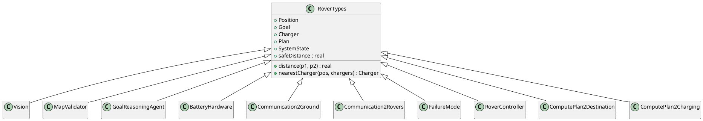
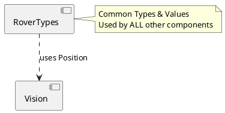

# RoverTypes コンポーネント仕様

## 概要
ローバーシステム全体で使用される共通の型、定数、関数を定義する基底クラス。全てのコンポーネントはこのクラスを継承して使用します。

## 型定義 (Types)

### `Position`
*   **定義**: `Vision`Position`
*   **説明**: 位置情報（Visionクラスの定義を再利用）。

### `GoalID`
*   **定義**: `token`
*   **説明**: ゴールを一意に識別するID。

### `ChargerID`
*   **定義**: `token`
*   **説明**: 充電器を一意に識別するID。

### `Priority`
*   **定義**: `nat`
*   **説明**: ゴールの優先度（自然数）。

### `MapStatus`
*   **定義**: `<Valid> | <Invalid>`
*   **説明**: マップの検証状態（有効/無効）。

### `PlanStatus`
*   **定義**: `<Ready> | <NoPlan> | <Failure>`
*   **説明**: プラン生成の状態（準備完了/プランなし/失敗）。

### `PlannerKind`
*   **定義**: `<Destination> | <Charging>`
*   **説明**: プランナーの種類（目的地用/充電用）。

### `MessageType`
*   **定義**: `<invalidMap> | <completed> | <noMoreViablePlans> | <failureModeInvoked> | <communicationData>`
*   **説明**: 通信メッセージの種類。

### `Fault`
*   **定義**: `<None> | <PlannerTimeout> | <LocalizationFault> | <CommFailure>`
*   **説明**: 故障の種類。

### `MovementCommand`
*   **定義**: `<Forward> | <Backward> | <Left> | <Right> | <Stop>`
*   **説明**: 移動コマンドの種類。

### `RecoveryAction`
*   **定義**: `<Reboot> | <RequestGroundHelp> | <RequestRoverHelp> | <Await>`
*   **説明**: 故障回復アクションの種類。

### `ConnectionState`
*   **定義**: `<Disconnected> | <Connected>`
*   **説明**: 通信接続状態。

### `Goal`
*   **定義**: `record id: GoalID, pos: Position, priority: Priority end`
*   **説明**: ゴール情報の定義。

### `Charger`
*   **定義**: `record id: ChargerID, pos: Position end`
*   **説明**: 充電器情報の定義。

### `Plan`
*   **定義**: `record steps: seq of Position end`
*   **説明**: 移動プランの定義（位置の列）。

### `MapReport`
*   **定義**: `record status: MapStatus, detail: seq of char end`
*   **説明**: マップ検証レポートの定義。

### `SystemState`
*   **定義**: `record battery: nat, rechargeFlag: bool, lastGoal: [Goal] end`
*   **説明**: システム状態のスナップショット（故障診断用）。

## 定数定義 (Values)

### `safeDistance`
*   **値**: `1.0`
*   **説明**: 障害物との安全距離（メートル）。

### `defaultMaxBattery`
*   **値**: `100`
*   **説明**: デフォルトの最大バッテリー容量。

### `reliabilityTarget`
*   **値**: `0.99`
*   **説明**: 目標とする信頼性指標。

## インスタンス変数と不変条件 (State & Invariants)
なし（基底クラスのため）

## オペレーション一覧

### `boolToText(flag)`
*   **事前条件**: なし
*   **事後条件**: なし
*   **説明**: ブール値を文字列（"true" または "false"）に変換します。
*   **関連要件**: ログ出力、デバッグ。

### `distance(p1, p2)`
*   **事前条件**: なし
*   **事後条件**: なし
*   **説明**: 2点間の距離（の二乗相当）を計算します。`Vision`クラスの関数をラップしています。
*   **関連要件**: 距離計算。

### `sameLocation(p1, p2)`
*   **事前条件**: なし
*   **事後条件**: なし
*   **説明**: 2点が同じ場所にあるか判定します（許容誤差 1E-6）。
*   **関連要件**: 位置一致判定。

### `planLength(p)`
*   **事前条件**: なし
*   **事後条件**: なし
*   **説明**: プランのステップ数を返します。
*   **関連要件**: プラン評価。

### `optionalPlanLength(plan)`
*   **事前条件**: なし
*   **事後条件**: なし
*   **説明**: `nil` 許容のプランを受け取り、そのステップ数を返します。`nil` の場合は 0 を返します。
*   **関連要件**: 安全なプラン長取得。

### `nearestCharger(pos, chargers)`
*   **事前条件**: なし
*   **事後条件**: なし
*   **説明**: 指定された位置から最も近い充電器を探索して返します。
*   **関連要件**: 最適な充電器の選択。

## UMLモデル (PlantUML)

### 1. クラス図 (Class Diagram)
`RoverTypes` が他の全てのコンポーネントの基底となっている関係を示します。

### 2. ステートマシン図 (State Machine Diagram)
本コンポーネントは型定義と純粋関数のみを提供し、状態を持たないため、ステートマシン図は省略します。

### 3. アクティビティ図 (Activity Diagram)
本コンポーネントの関数は単純な計算のみであり、複雑な制御フローを持たないため、アクティビティ図は省略します。

### 4. シーケンス図 (Sequence Diagram)
本コンポーネントは他のコンポーネントとの相互作用（メッセージ交換）を行わないため、シーケンス図は省略します。

### 5. コンポーネント図 (Component Diagram)
`RoverTypes` は `Vision` コンポーネントの型定義に依存しています。また、システム内の他の全てのコンポーネントから利用されます。

