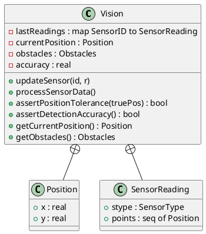
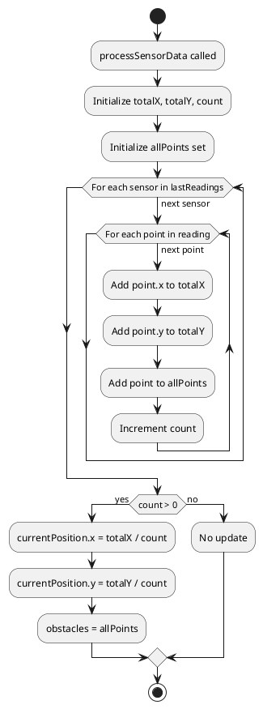
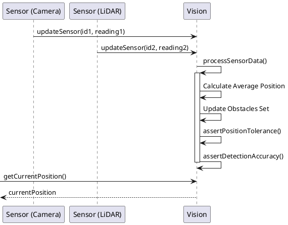
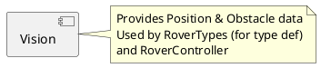

# Vision コンポーネント仕様

## 概要
センサ情報を統合し、ローバーの現在位置推定と障害物検知を行うクラス。

## 型定義 (Types)

### `SensorID`
*   **定義**: `token`
*   **説明**: センサIDを一意に識別するためのトークン。

### `SensorType`
*   **定義**: `<Camera> | <LiDAR>`
*   **説明**: センサの種類（カメラまたはLiDAR）。

### `Position`
*   **定義**: `record x: real, y: real end`
*   **説明**: 2次元座標を表すレコード。

### `SensorReading`
*   **定義**: `record stype: SensorType, points: seq of Position end`
*   **説明**: センサからの読み取りデータ。

### `Obstacles`
*   **定義**: `set of Position`
*   **説明**: 障害物の集合（位置の集合）。

## 定数定義 (Values)
なし

## インスタンス変数と不変条件 (State & Invariants)

### 変数一覧
*   `lastReadings`: `map SensorID to SensorReading` := `{|->}`
    *   **説明**: 最新のセンサ読み取り値を保持するマップ。
*   `currentPosition`: `Position` := `mk_Position(0.0, 0.0)`
    *   **説明**: 推定された現在のローバー位置。
*   `obstacles`: `Obstacles` := `{}`
    *   **説明**: 検知された障害物の集合。
*   `accuracy`: `real` := `0.95`
    *   **説明**: 現在の識別精度（0.0〜1.0）。

### 不変条件 (Invariant)
*   **式**: `accuracy >= 0.95`
*   **説明**: 識別精度は常に95%以上であること (V3要件)。
*   **式**: `forall id in set dom lastReadings & len lastReadings(id).points > 0`
*   **説明**: 登録された各センサは少なくとも1つの読み取り値を持っていること。
*   **式**: `forall obs in set obstacles & dist(currentPosition, obs) >= 1`
*   **説明**: 現在位置と全ての障害物は、最低安全距離（1m）以上離れていること。

## オペレーション一覧

### `dist(p1, p2)`
*   **事前条件**: `true`
*   **事後条件**: `RESULT >= 0`
*   **説明**: 2点間の距離の二乗を計算します（比較用）。
*   **関連要件**: 距離計算。

### `updateSensor(id, r)`
*   **事前条件**: `len r.points > 0` (読み取りデータには少なくとも1つの点が含まれていること)
*   **事後条件**: `lastReadings(id) = r` (指定されたIDの読み取り値が更新されていること)
*   **説明**: 指定されたセンサIDからの新しい読み取り値を登録します。
*   **関連要件**: センサデータの収集。

### `processSensorData()`
*   **事前条件**: `dom lastReadings <> {}` (少なくとも1つのセンサデータが存在すること)
*   **事後条件**: 
    *   `(exists id in set dom lastReadings & len lastReadings(id).points > 0) => (forall id in set dom lastReadings & elems lastReadings(id).points subset obstacles)`
    *   有効なデータがあれば位置が更新され、入力された全ての点が障害物として登録されていること。
*   **説明**: 蓄積された全てのセンサデータを処理し、現在位置 (`currentPosition`) と障害物集合 (`obstacles`) を更新します。全てのセンサからの点群の平均座標を計算し、それを現在位置とします。
*   **関連要件**: センサフュージョン、位置推定。

### `assertPositionTolerance(truePos)`
*   **事前条件**: `true`
*   **事後条件**: `RESULT => dist(truePos, currentPosition) <= 4` (結果が true ならば、距離の二乗が 4（2の二乗）以下であること)
*   **説明**: 推定位置が真の位置 (`truePos`) に対して許容誤差範囲内にあるかを検証します。
*   **関連要件**: **V4要件** (位置推定の誤差は±2m以内であること)。

### `assertDetectionAccuracy()`
*   **事前条件**: なし
*   **事後条件**: `RESULT => accuracy >= 0.95`
*   **説明**: 現在の識別精度が要件を満たしているかを検証します。
*   **関連要件**: **V3要件** (識別精度は常に95%以上であること)。

### `getCurrentPosition()`
*   **事前条件**: なし
*   **事後条件**: なし
*   **説明**: 現在の推定位置を取得します。
*   **関連要件**: 位置情報の提供。

### `getObstacles()`
*   **事前条件**: なし
*   **事後条件**: なし
*   **説明**: 現在検知されている障害物集合を取得します。
*   **関連要件**: 障害物情報の提供。

## UMLモデル (PlantUML)

### 1. クラス図 (Class Diagram)
`Vision` クラスの構造と、内部で使用する型定義を示します。

### 2. ステートマシン図 (State Machine Diagram)
本コンポーネントはデータを蓄積・処理する機能が主であり、明確な状態遷移（モード変化など）を持たないため、ステートマシン図は省略します。

### 3. アクティビティ図 (Activity Diagram)
`processSensorData` におけるセンサデータの集計と位置更新のロジックを示します。

### 4. シーケンス図 (Sequence Diagram)
センサデータの更新から位置推定、障害物検知までの処理フローを示します。

### 5. コンポーネント図 (Component Diagram)
`Vision` は独立したコンポーネントであり、他のコンポーネント（`RoverTypes`など）から参照されます。

